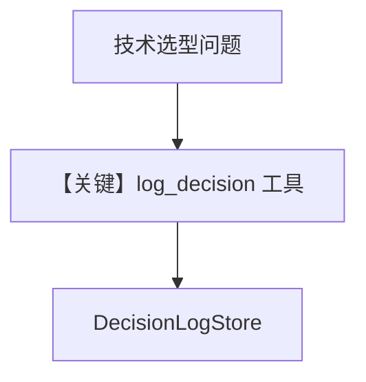

# 06_team_decision_log.py — 实现原理分析

> 源文件：`cookbook/03_teams/12_learning/06_team_decision_log.py`

## 概述

本示例展示 **`DecisionLogConfig`**（AGENTIC + `enable_agent_tools` + `agent_can_save` + `agent_can_search`）：架构评审类 Team 在重大技术决策时写入决策日志，支持审计与复盘。

**核心配置一览：**

| 配置项 | 值 |
|--------|-----|
| `learning` | `LearningMachine(decision_log=DecisionLogConfig(...))` |
| `instructions` | 要求显著决策时使用 `log_decision`（见 `.py` L61-64） |

### 运行机制与因果链

用户提出选型问题 → 队长协调成员 → 通过工具记录决策 → `decision_log_store.print` 查看。

## System Prompt 组装

队长 `instructions` 字面：

```text
You are an architecture review board.
When making significant technical decisions, use the log_decision tool to record them.
Include your reasoning and any alternatives you considered.
```

## Mermaid 流程图


```mermaid
flowchart TD
    Q["技术选型问题"] --> D["【关键】log_decision 工具"]
    D --> L["DecisionLogStore"]
```

## 关键源码文件索引

| 文件 | 作用 |
|------|------|
| `agno/learn/` | `DecisionLogConfig`、decision store |
