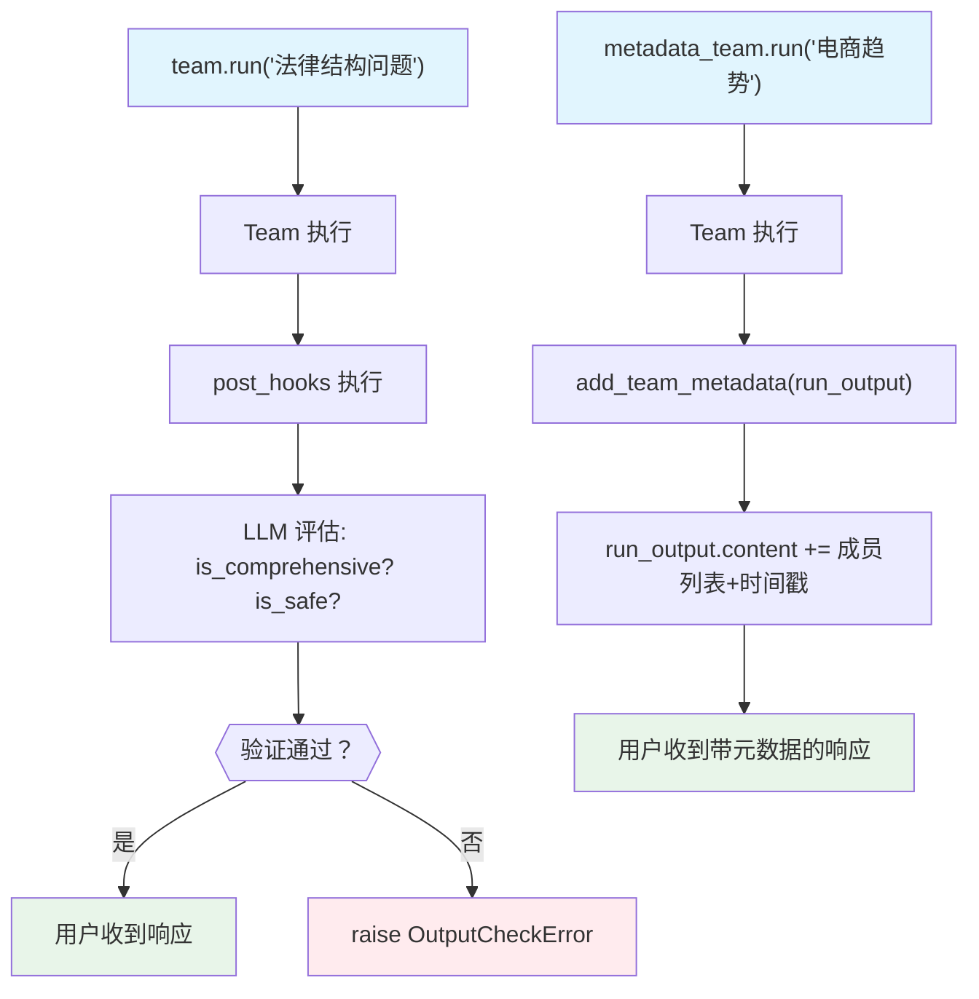

# post_hook_output.py — 实现原理分析

> 源文件：`cookbook/03_teams/13_hooks/post_hook_output.py`

## 概述

本示例展示 Agno Team 的 **`post_hooks` 输出验证与转换**：五种 post-hook 函数覆盖了从 LLM 质量评估（`validate_team_response_quality`）到轻量级协作检查（`simple_team_coordination_check`）、元数据附加（`add_team_metadata`）、协作摘要（`add_collaboration_summary`）到全结构化格式化（`structure_team_response`）的完整谱系。

**核心配置一览：**

| Team | `post_hooks` | 策略 |
|------|------------|------|
| `team_with_validation` | `[validate_team_response_quality]` | LLM 评估输出质量 |
| `team_simple` | `[simple_team_coordination_check]` | 关键词轻量检查 |
| `metadata_team` | `[add_team_metadata]` | 附加成员列表和时间戳 |
| `collab_team` | `[add_collaboration_summary]` | 附加成员贡献摘要 |
| `consulting_team` | `[structure_team_response]` | LLM 结构化重格式 |

## 核心组件解析

### `post_hooks` 签名

```python
def post_hook(run_output: TeamRunOutput, team: Team) -> None:
    ...
```

### `OutputCheckError` 阻止输出

```python
raise OutputCheckError(
    "Response doesn't show effective team collaboration.",
    check_trigger=CheckTrigger.OUTPUT_NOT_ALLOWED,
)
```

抛出后，用户不收到原始响应，可在异常处理中返回备用消息。

### 输出转换

```python
run_output.content = enhanced_content  # 直接替换内容
```

修改 `run_output.content` 即可转换最终输出，对用户完全透明。

### 验证 vs 转换两类 Hook

| 类型 | 行为 |
|------|------|
| 验证 | 不满足条件时抛出 `OutputCheckError` |
| 转换 | 修改 `run_output.content`，不抛出异常 |

## Mermaid 流程图



## 关键源码文件索引

| 文件 | 关键函数/类 | 作用 |
|------|------------|------|
| `agno/team/team.py` | `post_hooks` | 输出后处理 Hook 列表 |
| `agno/exceptions.py` | `OutputCheckError`, `CheckTrigger` | 输出验证错误 |
| `agno/run/team.py` | `TeamRunOutput` | 输出对象（可修改 content） |
