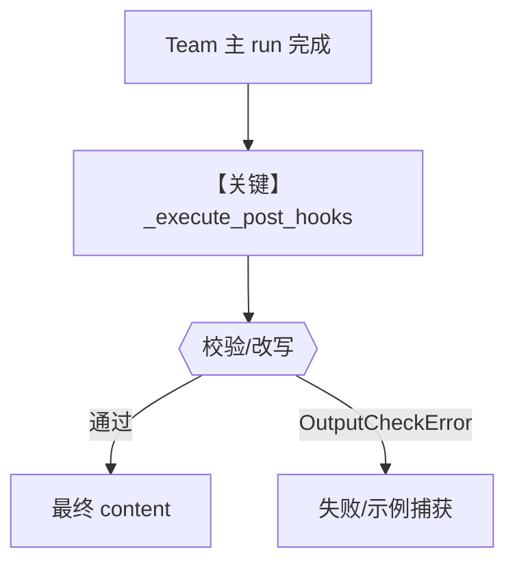

# post_hook_output.py — 实现原理分析

> 源文件：`cookbook/03_teams/13_hooks/post_hook_output.py`

## 概述

本示例展示 Team 的 **`post_hooks`**：在 `TeamRunOutput` 生成后执行校验（`OutputCheckError`）或改写 `run_output.content`（元数据、协作摘要、结构化重排）。多组 `Team` 演示从「LLM 质检」到「纯字符串启发式」的不同成本与效果。

**核心配置一览：**

| Team | `post_hooks` | 作用 |
|------|--------------|------|
| `team_with_validation` | `[validate_team_response_quality]` | 子 Agent + `output_schema` 多维度打分 |
| `team_simple` | `[simple_team_coordination_check]` | 关键词 + 长度 |
| `metadata_team` | `[add_team_metadata]` | 追加标题/成员/时间 |
| `collab_team` | `[add_collaboration_summary]` | 利用 `member_responses` 摘要 |
| `consulting_team` | `[structure_team_response]` | 子 Agent 格式化为 `FormattedTeamResponse` |

### 运行机制与因果链

`agno/team/_run.py` 在 run 完成路径调用 `_execute_post_hooks`（约 L379+），传入 `TeamRunOutput` 与 `Team`；钩子可 **抛错终止** 或 **原地修改 content**。

## System Prompt 组装

钩子**不改变** `get_system_message`；各 Team 的 `instructions` 见 `.py` L307-314、324-326 等，需对照源码还原。

## 完整 API 请求

主对话仍为 `OpenAIResponses` → `responses.create`；验证/格式化钩子内部额外 `validator_agent.run` / `formatter_agent.run` 再发起独立 API 调用。

## Mermaid 流程图

```mermaid
flowchart TD
    R["Team 主 run 完成"] --> P["【关键】_execute_post_hooks"]
    P --> V{{校验/改写}}
    V -->|通过| O["最终 content"]
    V -->|OutputCheckError| E["失败/示例捕获"]
```

## 关键源码文件索引

| 文件 | 作用 |
|------|------|
| `agno/team/_run.py` | `_execute_post_hooks` |
| `agno/team/_hooks.py` | 钩子执行逻辑 |
| `agno/exceptions.py` | `OutputCheckError`、`CheckTrigger` |
