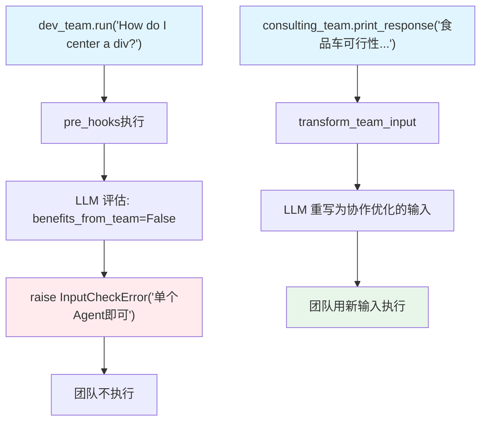

# pre_hook_input.py — 实现原理分析

> 源文件：`cookbook/03_teams/13_hooks/pre_hook_input.py`

## 概述

本示例展示 Agno Team 的 **`pre_hooks` 输入验证与转换**：两个 pre-hook 函数演示不同策略：`comprehensive_team_input_validation` 用 LLM 评估请求是否适合团队执行（简单问题拦截、不安全内容拦截），`transform_team_input` 将用户输入重写为更适合团队协作的格式。通过 `InputCheckError` 异常阻止不合适的请求。

**核心配置一览：**

| Team | `pre_hooks` | 策略 |
|------|------------|------|
| `dev_team` | `[comprehensive_team_input_validation]` | LLM 验证：过滤不适合团队的请求 |
| `consulting_team` | `[transform_team_input]` | LLM 转换：重写输入以优化协作 |

## 核心组件解析

### `pre_hooks` 签名

```python
def pre_hook(run_input: TeamRunInput, team: Team, session: TeamSession, 
             user_id: Optional[str], debug_mode: Optional[bool]) -> None:
    ...
```

或简化版（仅使用部分参数）：

```python
def pre_hook(run_input: TeamRunInput, team: Team) -> None:
    ...
```

### `InputCheckError` 阻止执行

```python
raise InputCheckError(
    "This request would be better handled by a single agent",
    check_trigger=CheckTrigger.INPUT_NOT_ALLOWED,
)
```

抛出后，团队不执行，调用方收到此异常（可 `except InputCheckError` 处理）。

### 输入转换

```python
run_input.input_content = transformation_result.content
```

直接修改 `run_input.input_content` 即可转换输入，团队用转换后的内容执行。

## Mermaid 流程图



## 关键源码文件索引

| 文件 | 关键函数/类 | 作用 |
|------|------------|------|
| `agno/team/team.py` | `pre_hooks` | 输入前处理 Hook 列表 |
| `agno/exceptions.py` | `InputCheckError`, `CheckTrigger` | 输入验证错误 |
| `agno/run/team.py` | `TeamRunInput` | 输入对象（可修改） |
