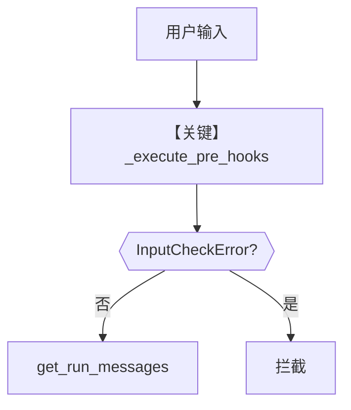

# pre_hook_input.py — 实现原理分析

> 源文件：`cookbook/03_teams/13_hooks/pre_hook_input.py`

## 概述

本示例展示 Team 的 **`pre_hooks`**：在正式协调前处理 `TeamRunInput`——`comprehensive_team_input_validation` 用子 Agent 判断请求是否值得上团队，`transform_team_input` 将用户话改写为更利协作的表述；失败时抛 `InputCheckError`。

**核心配置一览：**

| Team | `pre_hooks` | 说明 |
|------|-------------|------|
| `dev_team` | `[comprehensive_team_input_validation]` | 阻挡过简/无关/不安全请求 |
| `consulting_team` | `[transform_team_input]` | 重写 `run_input.input_content` |

### 运行机制与因果链

`_execute_pre_hooks`（`agno/team/_run.py` 约 L215+）在组装消息前运行；`transform_team_input` 可写回 `run_input.input_content`（L143）。

## System Prompt 组装

与 hook 无关；`dev_team`/`consulting_team` 的 `instructions`、`description` 见 `.py`。

## Mermaid 流程图

```mermaid
flowchart TD
    I["用户输入"] --> H["【关键】_execute_pre_hooks"]
    H --> C{{InputCheckError?}}
    C -->|否| M["get_run_messages"]
    C -->|是| B["拦截"]
```

## 关键源码文件索引

| 文件 | 作用 |
|------|------|
| `agno/team/_run.py` | `_execute_pre_hooks` |
| `agno/exceptions.py` | `InputCheckError` |
