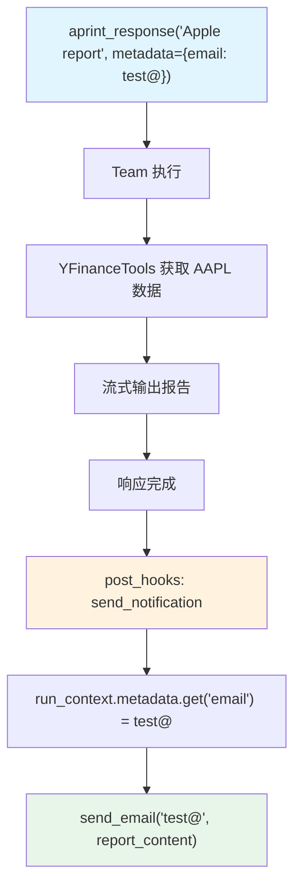

# stream_hook.py — 实现原理分析

> 源文件：`cookbook/03_teams/13_hooks/stream_hook.py`

## 概述

本示例展示 Agno Team 的 **`post_hooks` + `RunContext.metadata` 通知模式**：`send_notification` post-hook 从 `run_context.metadata` 读取用户 email，在响应生成完成后自动触发邮件发送。适合需要在 Team 响应完成后执行副作用操作（通知、日志、webhooks 等）的场景。

**核心配置一览：**

| 配置项 | 值 | 说明 |
|--------|------|------|
| `post_hooks` | `[send_notification]` | 响应完成后触发通知 |
| `tools` | `[YFinanceTools()]` | Leader 级金融数据工具 |
| `members` | `[]` | 无成员（Leader 独立处理） |

## 核心组件解析

### `RunContext.metadata` 的用途

`metadata` 是调用 `run()` / `aprint_response()` 时传入的任意字典：

```python
await team.aprint_response(
    "Generate a financial report for Apple (AAPL).",
    metadata={"email": "test@example.com"},
)
```

在 post-hook 中可通过 `run_context.metadata.get("email")` 读取，实现调用方向 hook 传递上下文信息。

### Post Hook 签名（含 RunContext）

```python
def send_notification(run_output: TeamRunOutput, run_context: RunContext) -> None:
    email = run_context.metadata.get("email")
    if email:
        send_email(email, run_output.content)
```

除 `team` 外，post-hook 也可接收 `run_context` 参数，获取完整的运行上下文。

### 流式场景下的 Post Hook

即使 `stream=True`，post-hook 在**所有流式块发送完毕后**才执行，此时 `run_output.content` 是完整的最终响应。

## Mermaid 流程图



## 关键源码文件索引

| 文件 | 关键函数/类 | 作用 |
|------|------------|------|
| `agno/team/team.py` | `post_hooks` | 输出后 Hook 列表 |
| `agno/run/context.py` | `RunContext.metadata` | 运行时元数据 |
| `agno/run/team.py` | `TeamRunOutput` | 输出对象 |
