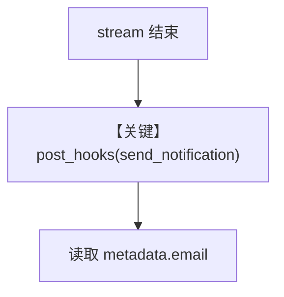

# stream_hook.py — 实现原理分析

> 源文件：`cookbook/03_teams/13_hooks/stream_hook.py`

## 概述

本示例展示 **`post_hooks` 签名 `(TeamRunOutput, RunContext)`**：在流式 `aprint_response` 结束后，根据 `run_context.metadata["email"]` 触发模拟邮件通知。注意 **`members=[]`** 时团队无成员，队长独自携带 `YFinanceTools` 完成「财经报告」演示。

**核心配置一览：**

| 配置项 | 值 |
|--------|-----|
| `members` | `[]` |
| `post_hooks` | `[send_notification]` |
| `tools` | `[YFinanceTools()]` |
| `metadata`（run 时） | `{"email": "test@example.com"}` |

### 运行机制与因果链

流式 run 仍会在完成阶段执行 post_hooks；`send_notification` 若 `metadata` 缺 `email` 则直接返回。

## System Prompt 组装

队长 `instructions` 字面：

```text
You are a helpful financial report team of agents.
Generate a financial report for the given company.
Keep it short and concise.
```

## 完整 API 请求

```python
client.responses.create(model="gpt-5.2", input=..., tools=yfinance_tools)
```

## Mermaid 流程图


```mermaid
flowchart TD
    S["stream 结束"] --> P["【关键】post_hooks(send_notification)"]
    P --> E["读取 metadata.email"]
```

## 关键源码文件索引

| 文件 | 作用 |
|------|------|
| `agno/team/_hooks.py` | post_hook 参数注入 RunContext |
