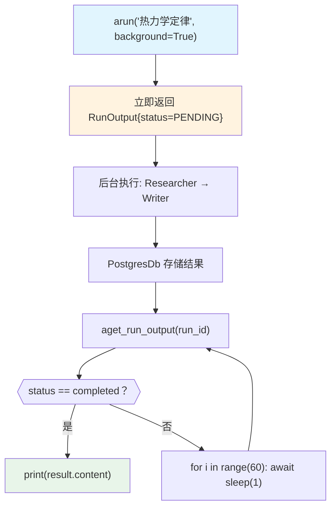

# background_execution.py — 实现原理分析

> 源文件：`cookbook/03_teams/14_run_control/background_execution.py`

## 概述

本示例展示 Agno Team 的 **`background=True` 后台异步执行**：`arun(background=True)` 立即返回 `PENDING` 状态的 `RunOutput`，实际工作在后台异步执行并存储到 PostgreSQL，调用方通过 `aget_run_output(run_id, session_id)` 轮询状态直到 `COMPLETED`，也可通过 `acancel_run(run_id)` 取消。

**核心配置一览：**

| 配置项 | 值 | 说明 |
|--------|------|------|
| `background=True` | run 参数 | 后台执行，立即返回 PENDING |
| `db` | `PostgresDb` | 必须配置，用于存储运行状态 |
| 轮询 API | `aget_run_output(run_id, session_id)` | 查询运行状态 |
| 取消 API | `acancel_run(run_id)` | 取消运行中的任务 |

## 核心组件解析

### 后台执行流程

```python
# 立即返回，不阻塞
run_output = await team.arun("...", background=True)
assert run_output.status == RunStatus.pending

# 轮询直到完成
for i in range(60):
    await asyncio.sleep(1)
    result = await team.aget_run_output(
        run_id=run_output.run_id,
        session_id=run_output.session_id,
    )
    if result and result.status == RunStatus.completed:
        print(result.content)
        break
```

### 使用场景

- **API 服务**：接收请求立即返回 202 Accepted + run_id，前端轮询
- **长时间任务**：写文章、复杂研究等，不阻塞 HTTP 连接
- **任务队列**：多个后台任务并发执行

### 后台运行状态枚举

| `RunStatus` | 含义 |
|-------------|------|
| `pending` | 已创建，等待执行 |
| `running` | 执行中 |
| `completed` | 成功完成 |
| `error` | 执行失败 |
| `cancelled` | 已取消 |

## Mermaid 流程图



## 关键源码文件索引

| 文件 | 关键函数/类 | 作用 |
|------|------------|------|
| `agno/team/team.py` | `arun(background=True)`, `aget_run_output()`, `acancel_run()` | 后台执行 API |
| `agno/run/base.py` | `RunStatus` | 运行状态枚举 |
