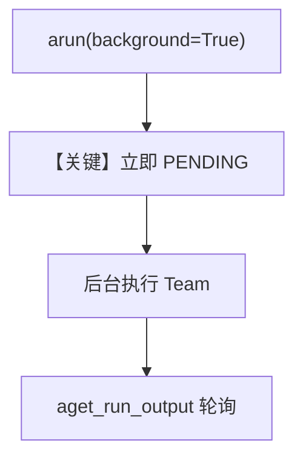

# background_execution.py — 实现原理分析

<!-- cookbook-py-source:start -->
## 完整源码

```python
"""
Example demonstrating background execution with a Team.

Background execution allows you to start a team run that returns immediately
with a PENDING status, while the actual work continues in the background.
You can then poll for completion or cancel the run.

Requirements:
- PostgreSQL running (./cookbook/scripts/run_pgvector.sh)
- OPENAI_API_KEY set

Usage:
    .venvs/demo/bin/python cookbook/03_teams/14_run_control/background_execution.py
"""

import asyncio

from agno.agent import Agent
from agno.db.postgres import PostgresDb
from agno.models.openai import OpenAIResponses
from agno.run.base import RunStatus
from agno.team import Team

# ---------------------------------------------------------------------------
# Setup
# ---------------------------------------------------------------------------
db = PostgresDb(
    db_url="postgresql+psycopg://ai:ai@localhost:5532/ai",
    session_table="team_bg_exec_sessions",
)


# ---------------------------------------------------------------------------
# Create and Run Examples
# ---------------------------------------------------------------------------
async def example_team_background_run():
    """Start a team background run and poll until complete."""
    print("=" * 60)
    print("Team Background Run with Polling")
    print("=" * 60)

    researcher = Agent(
        name="Researcher",
        model=OpenAIResponses(id="gpt-5-mini"),
        role="Research topics and provide factual information.",
    )

    writer = Agent(
        name="Writer",
        model=OpenAIResponses(id="gpt-5-mini"),
        role="Write clear and concise summaries.",
    )

    team = Team(
        name="ResearchTeam",
        model=OpenAIResponses(id="gpt-5-mini"),
        members=[researcher, writer],
        instructions=[
            "First, have the researcher gather key facts.",
            "Then, have the writer create a concise summary.",
        ],
        db=db,
    )

    # Start a background run -- returns immediately with PENDING status
    run_output = await team.arun(
        "What are the three laws of thermodynamics? Summarize each in one sentence.",
        background=True,
    )

    print(f"Run ID: {run_output.run_id}")
    print(f"Session ID: {run_output.session_id}")
    print(f"Status: {run_output.status}")
    assert run_output.status == RunStatus.pending, (
        f"Expected PENDING, got {run_output.status}"
    )

    # Poll for completion
    print("\nPolling for completion...")
    for i in range(60):
        await asyncio.sleep(1)
        result = await team.aget_run_output(
            run_id=run_output.run_id,
            session_id=run_output.session_id,
        )
        if result is None:
            print(f"  [{i + 1}s] Run not found in DB yet")
            continue

        print(f"  [{i + 1}s] Status: {result.status}")

        if result.status == RunStatus.completed:
            print(f"\nCompleted! Content:\n{result.content}")
            break
        elif result.status == RunStatus.error:
            print(f"\nFailed! Content: {result.content}")
            break
    else:
        print("\nTimed out waiting for completion")


async def example_cancel_team_background_run():
    """Start a team background run and cancel it."""
    print()
    print("=" * 60)
    print("Cancel a Team Background Run")
    print("=" * 60)

    researcher = Agent(
        name="Researcher",
        model=OpenAIResponses(id="gpt-5-mini"),
        role="Research topics thoroughly.",
    )

    writer = Agent(
        name="Writer",
        model=OpenAIResponses(id="gpt-5-mini"),
        role="Write detailed essays.",
    )

    team = Team(
        name="EssayTeam",
        model=OpenAIResponses(id="gpt-5-mini"),
        members=[researcher, writer],
        instructions=[
            "Have the researcher gather comprehensive information.",
            "Then have the writer create a detailed essay.",
        ],
        db=db,
    )

    # Start a long background run
    run_output = await team.arun(
        "Write a detailed essay about the history of artificial intelligence. "
        "Make it at least 3000 words.",
        background=True,
    )

    print(f"Run ID: {run_output.run_id}")
    print(f"Status: {run_output.status}")

    # Wait a moment, then cancel
    await asyncio.sleep(3)
    print("Cancelling run...")
    cancelled = await team.acancel_run(run_id=run_output.run_id)
    print(f"Cancel result: {cancelled}")

    # Check final state
    await asyncio.sleep(1)
    result = await team.aget_run_output(
        run_id=run_output.run_id,
        session_id=run_output.session_id,
    )
    if result:
        print(f"Final status: {result.status}")


# ---------------------------------------------------------------------------
# Run Demo
# ---------------------------------------------------------------------------
async def main():
    await example_team_background_run()
    await example_cancel_team_background_run()
    print("\nAll examples completed!")


if __name__ == "__main__":
    asyncio.run(main())
```

<!-- cookbook-py-source:end -->

> 源文件：`cookbook/03_teams/14_run_control/background_execution.py`

## 概述

本示例展示 **`arun(..., background=True)`**：立即返回 `RunStatus.pending` 的 `TeamRunOutput`，实际推理在后台继续；通过 `aget_run_output` 轮询直至 `completed`/`error`，并演示 `acancel_run` 取消长任务。

**核心配置一览：**

| 配置项 | 值 |
|--------|-----|
| `db` | `PostgresDb`，`session_table="team_bg_exec_sessions"` |
| `background` | `True`（仅 arun 参数） |

### 运行机制与因果链

需要 **Postgres** 持久化 run 记录；轮询用 `run_id` + `session_id`。取消后状态由 `aget_run_output` 反映。

## System Prompt 组装

与同步 Team 相同；本文件侧重 **运行控制** 而非 prompt。

## 完整 API 请求

后台任务内部仍调用模型 `responses.create` / 流式等价；本示例不暴露 HTTP 细节。

## Mermaid 流程图


```mermaid
flowchart TD
    A["arun(background=True)"] --> P["【关键】立即 PENDING"]
    P --> W["后台执行 Team"]
    W --> Q["aget_run_output 轮询"]
```

## 关键源码文件索引

| 文件 | 作用 |
|------|------|
| `agno/team/_run.py` | `background` 分支与存储 |
| `agno/run/base.py` | `RunStatus` |
