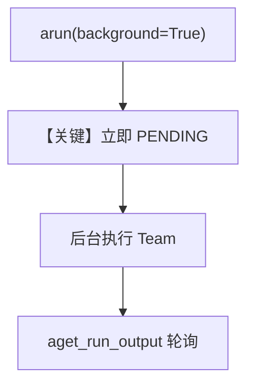

# background_execution.py — 实现原理分析

> 源文件：`cookbook/03_teams/14_run_control/background_execution.py`

## 概述

本示例展示 **`arun(..., background=True)`**：立即返回 `RunStatus.pending` 的 `TeamRunOutput`，实际推理在后台继续；通过 `aget_run_output` 轮询直至 `completed`/`error`，并演示 `acancel_run` 取消长任务。

**核心配置一览：**

| 配置项 | 值 |
|--------|-----|
| `db` | `PostgresDb`，`session_table="team_bg_exec_sessions"` |
| `background` | `True`（仅 arun 参数） |

### 运行机制与因果链

需要 **Postgres** 持久化 run 记录；轮询用 `run_id` + `session_id`。取消后状态由 `aget_run_output` 反映。

## System Prompt 组装

与同步 Team 相同；本文件侧重 **运行控制** 而非 prompt。

## 完整 API 请求

后台任务内部仍调用模型 `responses.create` / 流式等价；本示例不暴露 HTTP 细节。

## Mermaid 流程图

```mermaid
flowchart TD
    A["arun(background=True)"] --> P["【关键】立即 PENDING"]
    P --> W["后台执行 Team"]
    W --> Q["aget_run_output 轮询"]
```

## 关键源码文件索引

| 文件 | 作用 |
|------|------|
| `agno/team/_run.py` | `background` 分支与存储 |
| `agno/run/base.py` | `RunStatus` |
