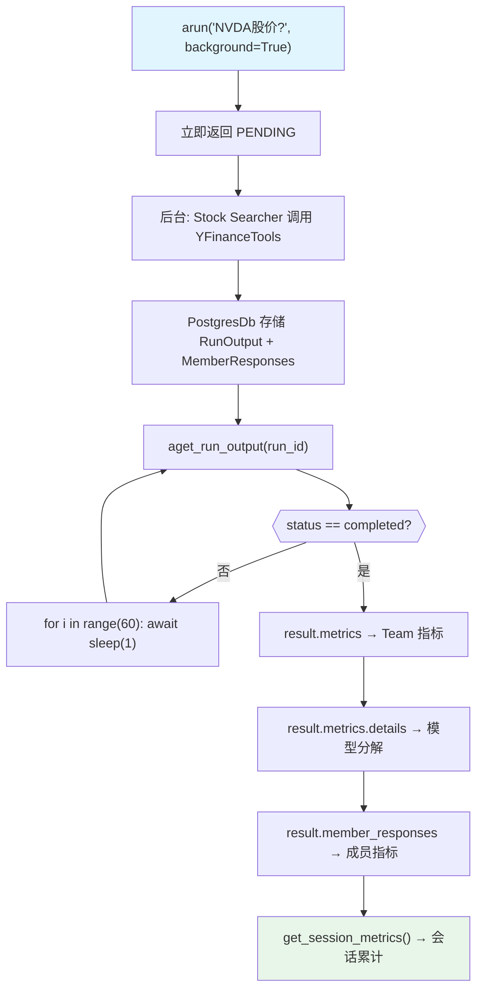

# background_execution_metrics.py — 实现原理分析

> 源文件：`cookbook/03_teams/14_run_control/background_execution_metrics.py`

## 概述

本示例展示 **后台运行的完整 Metrics 追踪**：Team 后台执行完成后，`RunOutput` 包含与同步运行完全相同的指标数据——token 消耗、模型详情、耗时，以及成员级别的独立 Metrics 分解。`store_member_responses=True` 确保成员响应被持久化，便于后续分析。

**核心配置一览：**

| 配置项 | 值 | 说明 |
|--------|------|------|
| `background=True` | run 参数 | 后台执行 |
| `store_member_responses` | `True` | 持久化成员响应（含 metrics） |
| `result.metrics` | `RunMetrics` | Team 级别汇总指标 |
| `result.member_responses` | `list[RunResponse]` | 各成员独立指标 |
| `team.get_session_metrics()` | 方法 | 会话级别累计指标 |

## 核心组件解析

### Metrics 三层结构

```
result.metrics               # Team 级别（汇总所有成员）
  └── result.metrics.details # 按模型类型分解的 ModelMetrics
result.member_responses      # 各成员独立 RunResponse
  └── member_response.metrics # 成员级别 metrics
team.get_session_metrics()   # 整个 session 的累计指标
```

### 数据读取示例

```python
# 按模型类型分解
for model_type, model_metrics_list in result.metrics.details.items():
    print(f"{model_type}:")  # e.g., "OpenAIChat"
    for m in model_metrics_list:
        pprint(m)  # input_tokens, output_tokens, time...

# 成员级别
for member_response in result.member_responses:
    print(f"Member: {member_response.agent_name}")
    pprint(member_response.metrics)

# Session 级别
pprint(team.get_session_metrics())
```

### 为何后台运行需要 `store_member_responses=True`

后台运行时成员响应是临时生成的，若不持久化，轮询 `aget_run_output` 得到的 `result.member_responses` 将为空。

## Mermaid 流程图



## 关键源码文件索引

| 文件 | 关键函数/类 | 作用 |
|------|------------|------|
| `agno/team/team.py` | `arun(background=True)`, `aget_run_output()`, `get_session_metrics()` | 后台执行与指标获取 |
| `agno/run/base.py` | `RunMetrics`, `RunStatus` | 指标数据结构和状态枚举 |
