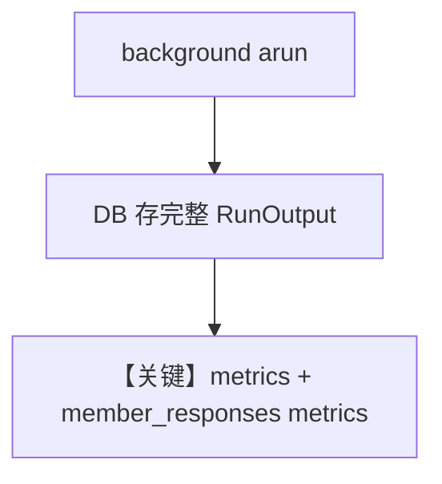

# background_execution_metrics.py — 实现原理分析

> 源文件：`cookbook/03_teams/14_run_control/background_execution_metrics.py`

## 概述

本示例展示 **后台 Team run 完成后 `metrics` 与成员级指标** 与同步 run 一致：`result.metrics`、`result.metrics.details`、`member_responses[].metrics`，以及 `team.get_session_metrics()`。

**核心配置一览：**

| 配置项 | 值 |
|--------|-----|
| `model`（队长与成员） | `OpenAIChat(id="gpt-4o-mini")` | **Chat Completions API** |
| `show_members_responses` | `True` |
| `store_member_responses` | `True` |
| `db` | `PostgresDb`，`team_bg_metrics_sessions` |

### 运行机制与因果链

`background=True` → 轮询到 `completed` → 打印聚合与成员 metrics。

## 完整 API 请求

```python
from openai import OpenAI
client = OpenAI()
client.chat.completions.create(
    model="gpt-4o-mini",
    messages=[...],
    tools=[...],
)
```

（`OpenAIChat` 走 Chat Completions，与 `OpenAIResponses` 不同。）

## Mermaid 流程图


```mermaid
flowchart TD
    B["background arun"] --> D["DB 存完整 RunOutput"]
    D --> M["【关键】metrics + member_responses metrics"]
```

## 关键源码文件索引

| 文件 | 作用 |
|------|------|
| `agno/models/openai/chat.py` | `OpenAIChat.invoke` |
| `agno/run/team/` | `TeamRunOutput` metrics 字段 |
