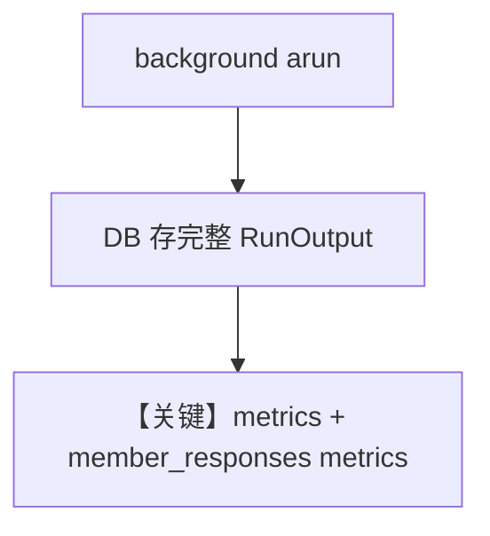

# background_execution_metrics.py — 实现原理分析

<!-- cookbook-py-source:start -->
## 完整源码

```python
"""
Team Background Execution Metrics
==================================

Demonstrates that metrics are fully tracked for team background runs.

When a team runs in the background, the run completes asynchronously
and is stored in the database. Once complete, the run output includes
the same metrics as a synchronous run: token counts, model details,
duration, and member-level breakdown.
"""

import asyncio

from agno.agent import Agent
from agno.db.postgres import PostgresDb
from agno.models.openai import OpenAIChat
from agno.run.base import RunStatus
from agno.team import Team
from agno.tools.yfinance import YFinanceTools
from rich.pretty import pprint

# ---------------------------------------------------------------------------
# Config
# ---------------------------------------------------------------------------
db = PostgresDb(
    db_url="postgresql+psycopg://ai:ai@localhost:5532/ai",
    session_table="team_bg_metrics_sessions",
)

# ---------------------------------------------------------------------------
# Create Team
# ---------------------------------------------------------------------------
stock_searcher = Agent(
    name="Stock Searcher",
    model=OpenAIChat(id="gpt-4o-mini"),
    role="Searches for stock information.",
    tools=[YFinanceTools(enable_stock_price=True)],
)

team = Team(
    name="Stock Research Team",
    model=OpenAIChat(id="gpt-4o-mini"),
    members=[stock_searcher],
    db=db,
    show_members_responses=True,
    store_member_responses=True,
)


# ---------------------------------------------------------------------------
# Run in background and inspect metrics
# ---------------------------------------------------------------------------
async def main():
    run_output = await team.arun(
        "What is the stock price of NVDA?",
        background=True,
    )

    print(f"Run ID: {run_output.run_id}")
    print(f"Status: {run_output.status}")

    # Poll for completion
    result = None
    for i in range(60):
        await asyncio.sleep(1)
        result = await team.aget_run_output(
            run_id=run_output.run_id,
            session_id=run_output.session_id,
        )
        if result and result.status in (RunStatus.completed, RunStatus.error):
            print(f"Completed after {i + 1}s")
            break

    if result is None or result.status != RunStatus.completed:
        print("Run did not complete in time")
        return

    # ----- Team metrics -----
    print("\n" + "=" * 50)
    print("TEAM METRICS")
    print("=" * 50)
    pprint(result.metrics)

    # ----- Model details breakdown -----
    print("\n" + "=" * 50)
    print("MODEL DETAILS")
    print("=" * 50)
    if result.metrics and result.metrics.details:
        for model_type, model_metrics_list in result.metrics.details.items():
            print(f"\n{model_type}:")
            for model_metric in model_metrics_list:
                pprint(model_metric)

    # ----- Member metrics -----
    print("\n" + "=" * 50)
    print("MEMBER METRICS")
    print("=" * 50)
    if result.member_responses:
        for member_response in result.member_responses:
            print(f"\nMember: {member_response.agent_name}")
            print("-" * 40)
            pprint(member_response.metrics)

    # ----- Session metrics -----
    print("\n" + "=" * 50)
    print("SESSION METRICS")
    print("=" * 50)
    session_metrics = team.get_session_metrics()
    if session_metrics:
        pprint(session_metrics)


if __name__ == "__main__":
    asyncio.run(main())
```

<!-- cookbook-py-source:end -->

> 源文件：`cookbook/03_teams/14_run_control/background_execution_metrics.py`

## 概述

本示例展示 **后台 Team run 完成后 `metrics` 与成员级指标** 与同步 run 一致：`result.metrics`、`result.metrics.details`、`member_responses[].metrics`，以及 `team.get_session_metrics()`。

**核心配置一览：**

| 配置项 | 值 |
|--------|-----|
| `model`（队长与成员） | `OpenAIChat(id="gpt-4o-mini")` | **Chat Completions API** |
| `show_members_responses` | `True` |
| `store_member_responses` | `True` |
| `db` | `PostgresDb`，`team_bg_metrics_sessions` |

### 运行机制与因果链

`background=True` → 轮询到 `completed` → 打印聚合与成员 metrics。

## 完整 API 请求

```python
from openai import OpenAI
client = OpenAI()
client.chat.completions.create(
    model="gpt-4o-mini",
    messages=[...],
    tools=[...],
)
```

（`OpenAIChat` 走 Chat Completions，与 `OpenAIResponses` 不同。）

## Mermaid 流程图


```mermaid
flowchart TD
    B["background arun"] --> D["DB 存完整 RunOutput"]
    D --> M["【关键】metrics + member_responses metrics"]
```

## 关键源码文件索引

| 文件 | 作用 |
|------|------|
| `agno/models/openai/chat.py` | `OpenAIChat.invoke` |
| `agno/run/team/` | `TeamRunOutput` metrics 字段 |
