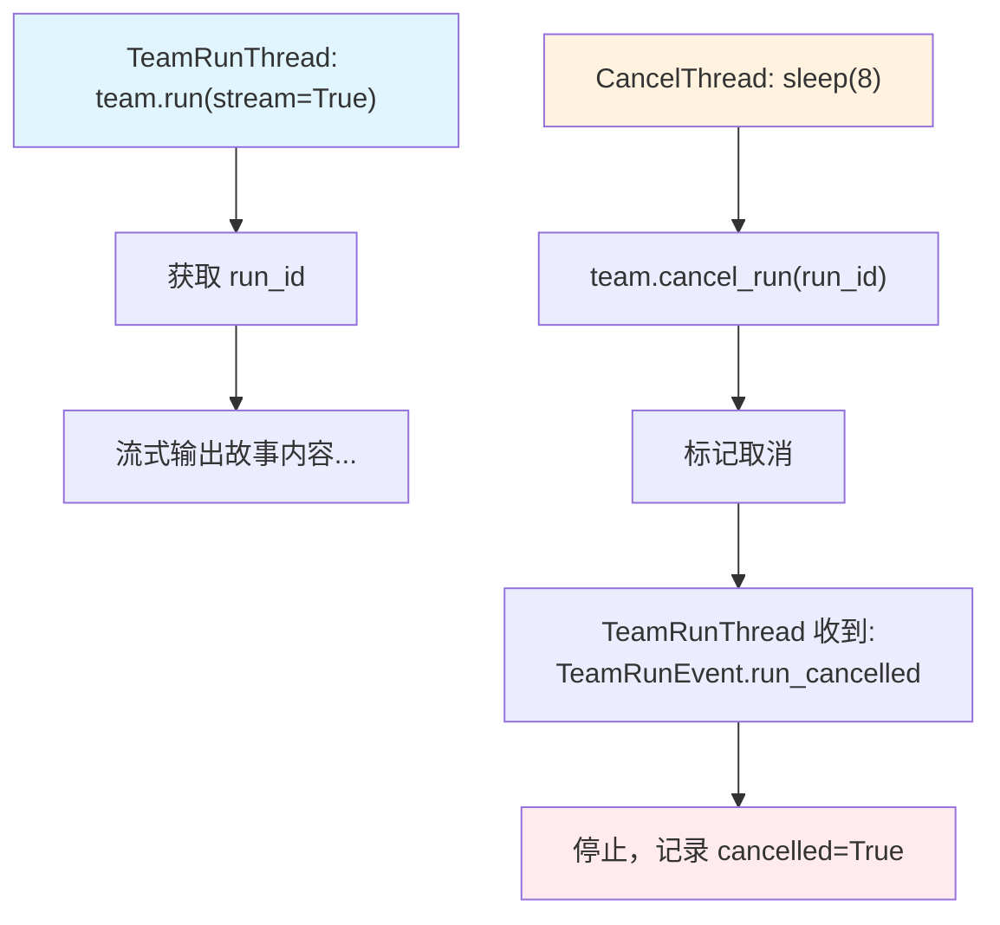

# cancel_run.py — 实现原理分析

> 源文件：`cookbook/03_teams/14_run_control/cancel_run.py`

## 概述

本示例展示 Agno Team 的 **流式运行取消**：使用两个线程并发运行——一个线程启动流式 Team 运行，另一个线程等待8秒后调用 `team.cancel_run(run_id)` 取消。通过事件流中的 `RunEvent.run_cancelled` / `TeamRunEvent.run_cancelled` 事件检测取消成功。

**核心配置一览：**

| 配置项 | 值 | 说明 |
|--------|------|------|
| `team.cancel_run(run_id)` | 同步取消 API | 标记运行为取消状态 |
| 取消事件 | `TeamRunEvent.run_cancelled` | Team 级取消事件 |
| 取消事件 | `RunEvent.run_cancelled` | 成员 Agent 取消事件 |

## 核心组件解析

### 取消流程

```
Thread 1 (团队运行):
  chunk = team.run("长故事...", stream=True)
  → 从 chunk.run_id 获取 run_id
  → 流式输出内容...
  
Thread 2 (取消线程):
  sleep(8)
  success = team.cancel_run(run_id)
  → 标记为取消状态

Thread 1 收到:
  chunk.event == TeamRunEvent.run_cancelled
  → 停止循环，记录结果
```

### `cancel_run` vs `acancel_run`

| API | 场景 |
|-----|------|
| `team.cancel_run(run_id)` | 同步（多线程场景） |
| `await team.acancel_run(run_id)` | 异步（asyncio 场景） |

### `run_id` 的获取时机

从流式 chunk 中提取：

```python
if "run_id" not in run_id_container and chunk.run_id:
    run_id_container["run_id"] = chunk.run_id
```

第一个 chunk 通常包含 `run_id`。

## Mermaid 流程图



## 关键源码文件索引

| 文件 | 关键函数/类 | 作用 |
|------|------------|------|
| `agno/team/team.py` | `cancel_run()`, `acancel_run()` | 同步/异步取消 |
| `agno/run/team.py` | `TeamRunEvent.run_cancelled` | 取消事件 |
