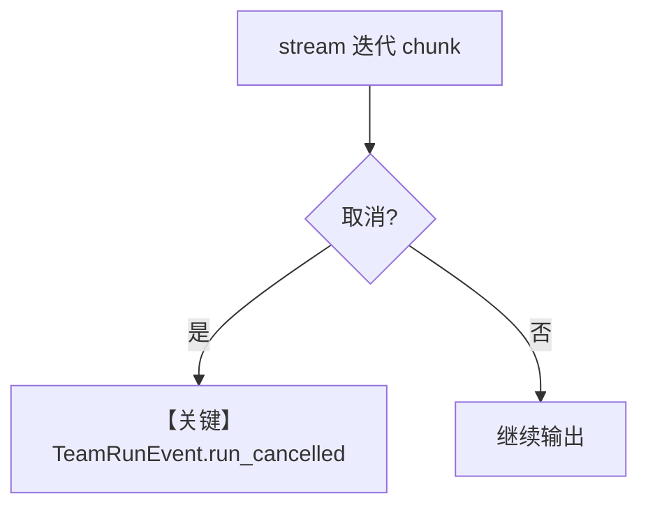

# cancel_run.py — 实现原理分析

> 源文件：`cookbook/03_teams/14_run_control/cancel_run.py`

## 概述

本示例展示 **流式 Team run + 跨线程 `cancel_run(run_id)`**：主线程迭代 `team.run(..., stream=True)` 消费 chunk，另一线程延迟后调用 `team.cancel_run`，并识别 `TeamRunEvent.run_cancelled` / `RunEvent.run_cancelled` 事件。

**核心配置一览：**

| 配置项 | 值 |
|--------|-----|
| `model` | `OpenAIResponses(id="gpt-5-mini")` |
| `members` | Storyteller + Editor |
| `stream` | `True` |

### 运行机制与因果链

`run_id` 从首个 chunk 提取；取消后流结束并带取消事件。全局取消由框架与 `CancellationManager` 协同（参见其它 guardrail cookbook）。

## System Prompt 组装

默认 Team；`description` 见 `.py` L141。

## Mermaid 流程图

```mermaid
flowchart TD
    S["stream 迭代 chunk"] --> R{"取消?"}
    R -->|是| C["【关键】TeamRunEvent.run_cancelled"]
    R -->|否| T["继续输出"]
```

## 关键源码文件索引

| 文件 | 作用 |
|------|------|
| `agno/team/team.py` | `cancel_run` |
