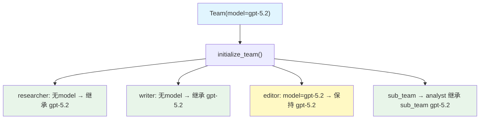

# model_inheritance.py — 实现原理分析

> 源文件：`cookbook/03_teams/14_run_control/model_inheritance.py`

## 概述

本示例展示 Agno Team 的 **模型继承机制**：没有显式配置 `model` 的成员 Agent 会从 Team 的 `model` 继承，而显式配置了 `model` 的成员（如 Editor 用 gpt-5.2）则保持自己的模型。嵌套 Team 同理。`initialize_team()` 触发继承逻辑，可在运行前查看各成员最终使用的模型。

**核心配置一览：**

| 成员 | 显式 model | 最终 model |
|------|-----------|-----------|
| researcher | 无 | 继承 Team: gpt-5.2 |
| writer | 无 | 继承 Team: gpt-5.2 |
| editor | gpt-5.2（显式） | gpt-5.2（自己的） |
| sub_team（analyst） | 无（sub_team 有 gpt-5.2） | 继承 sub_team: gpt-5.2 |

## 核心组件解析

### 模型继承规则

```python
team = Team(
    model=OpenAIResponses(id="gpt-5.2"),  # 父 Team 模型
    members=[researcher, writer, editor, sub_team],
)
```

1. 成员 `Agent` 没有 `model` → 继承父 Team 的 `model`
2. 成员 `Agent` 有 `model` → 保持自己的模型
3. 嵌套 `Team` 作为成员 → 按嵌套 Team 自身的 `model` 配置

### `initialize_team()` 的作用

```python
team.initialize_team()
print(f"Researcher model: {researcher.model.id}")  # gpt-5.2
print(f"Editor model: {editor.model.id}")  # gpt-5.2（自己配置的）
```

`initialize_team()` 触发模型继承和其他初始化逻辑，正常 `run()` 也会自动调用，此例显式调用是为了检查继承结果。

### 实际价值

模型继承简化配置：只需在 Team 层指定一次模型，大多数成员自动继承，特殊成员按需覆盖。

## Mermaid 流程图



## 关键源码文件索引

| 文件 | 关键函数/类 | 作用 |
|------|------------|------|
| `agno/team/team.py` | `initialize_team()` | 触发模型继承和初始化 |
