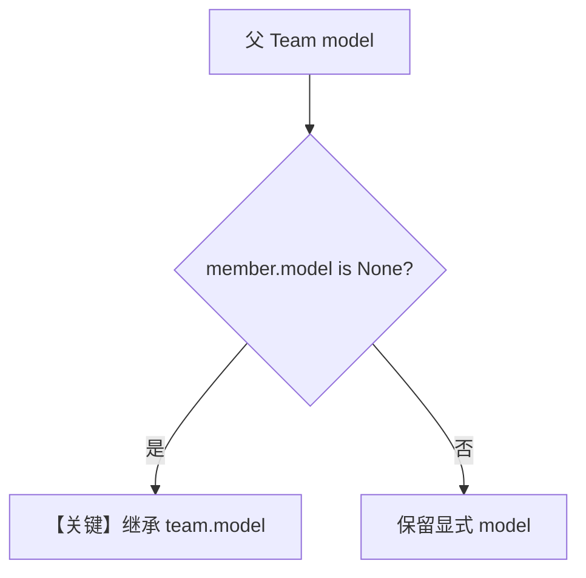

# model_inheritance.py — 实现原理分析

> 源文件：`cookbook/03_teams/14_run_control/model_inheritance.py`

## 概述

本示例展示 **`initialize_team()` 后成员模型继承**：未显式设置 `model` 的 `Agent` 继承父 `Team.model`；已设置者（如 `editor`）保留自有 `OpenAIResponses`；嵌套 `sub_team` 先解析子 Team 默认模型再递归初始化成员。

**核心配置一览：**

| 配置项 | 值 |
|--------|-----|
| 父 `team.model` | `OpenAIResponses(id="gpt-5.2")` |
| `editor.model` | 显式 `gpt-5.2`（与父同 id，仍为显式赋值） |
| `researcher`/`writer`/`analyst` | 初始 `model=None` → 继承 |

### 源码锚点

`agno/team/_init.py` `_initialize_member` L482-485：

```python
if member.model is None and team.model is not None:
    member.model = team.model
```

### 运行机制与因果链

`team.initialize_team()` 显式调用与 `run` 前自动初始化均可触发成员绑定；嵌套 Team 见 L487-496。

## System Prompt 组装

继承只影响 **用哪个模型发请求**，不改变 Team `get_system_message` 结构。

## Mermaid 流程图


```mermaid
flowchart TD
    T["父 Team model"] --> A{"member.model is None?"}
    A -->|是| I["【关键】继承 team.model"]
    A -->|否| K["保留显式 model"]
```

## 关键源码文件索引

| 文件 | 作用 |
|------|------|
| `agno/team/_init.py` | `_initialize_member`、`initialize_team` |
