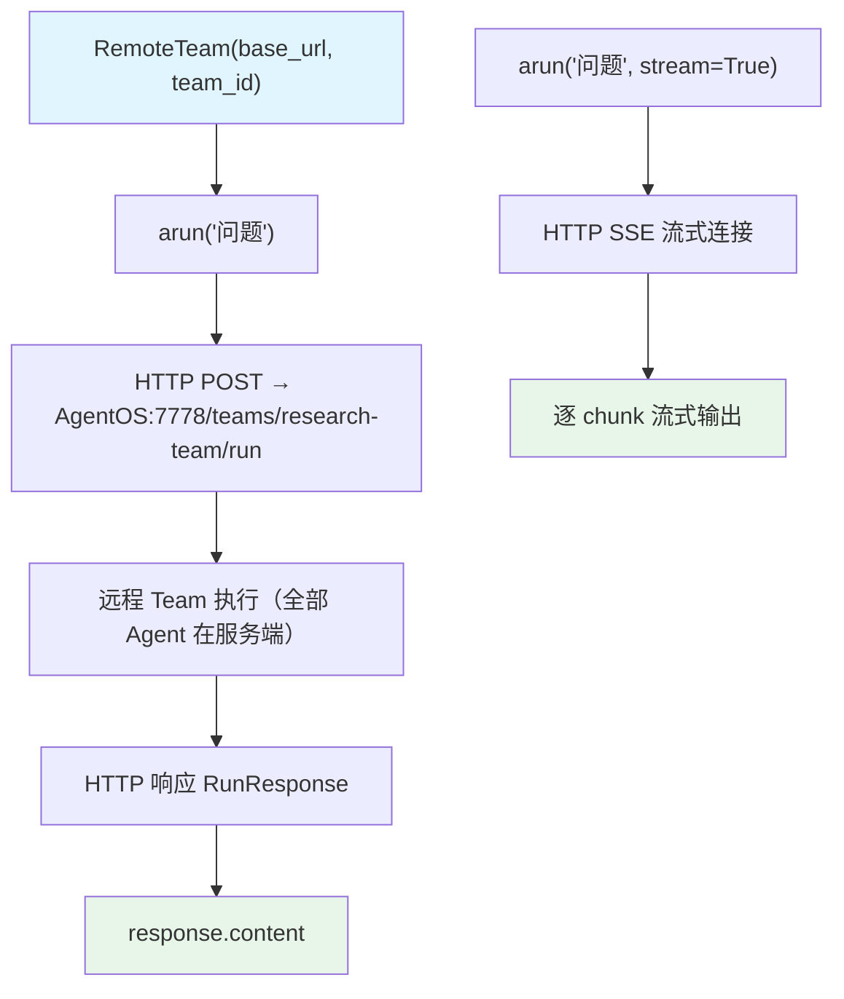

# remote_team.py — 实现原理分析

> 源文件：`cookbook/03_teams/14_run_control/remote_team.py`

## 概述

本示例展示 **`RemoteTeam`** 的使用：通过 `base_url` 和 `team_id` 连接到远程 AgentOS 实例上托管的 Team，支持普通 `arun()` 调用和 `stream=True` 流式输出，API 与本地 Team 完全一致。`RemoteServerUnavailableError` 优雅处理服务不可用情况。

**核心配置一览：**

| 配置项 | 值 | 说明 |
|--------|------|------|
| `base_url` | `"http://localhost:7778"` | AgentOS 实例地址 |
| `team_id` | `"research-team"` | 远程 Team 标识符 |
| `user_id` / `session_id` | 字符串 | 会话隔离参数（透传给远程） |

## 核心组件解析

### RemoteTeam vs 本地 Team

| 特性 | 本地 Team | RemoteTeam |
|------|----------|------------|
| 执行位置 | 本地进程 | 远程 AgentOS |
| API | `team.run()` / `team.arun()` | `remote_team.arun()`（仅异步） |
| 流式 | `stream=True` | `stream=True`（相同） |
| 配置 | 代码内配置 | 服务端配置 |
| 错误 | Python 异常 | `RemoteServerUnavailableError` |

### 普通调用

```python
response = await remote_team.arun(
    "What is the capital of France?",
    user_id="user-123",
    session_id="session-456",
)
print(response.content)
```

### 流式调用

```python
async for chunk in remote_team.arun(
    "Tell me a horror story",
    session_id="session-456",
    user_id="user-123",
    stream=True,
):
    if hasattr(chunk, "content") and chunk.content:
        print(chunk.content, end="", flush=True)
```

### 错误处理

```python
except (ConnectionError, TimeoutError, OSError,
        socket.gaierror, RemoteServerUnavailableError):
    print("服务不可用，请先启动 AgentOS 实例")
```

### 使用场景

- **微服务架构**：将复杂 Team 部署为独立服务，多客户端复用
- **AgentOS 托管**：生产环境中集中管理 Agent 和 Team
- **跨语言集成**：任何能发 HTTP 请求的客户端均可调用

## Mermaid 流程图



## 关键源码文件索引

| 文件 | 关键函数/类 | 作用 |
|------|------------|------|
| `agno/team/team.py` | `RemoteTeam` | 远程 Team 客户端封装 |
| `agno/exceptions.py` | `RemoteServerUnavailableError` | 服务不可用异常 |
