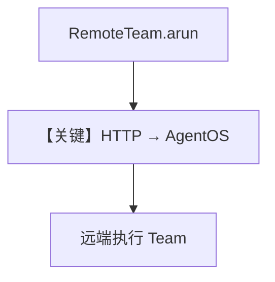

# remote_team.py — 实现原理分析

<!-- cookbook-py-source:start -->
## 完整源码

```python
"""
Remote Team
=============================

Demonstrates calling and streaming a team hosted on a remote AgentOS instance.
"""

import asyncio
import socket

from agno.exceptions import RemoteServerUnavailableError
from agno.team import RemoteTeam

# ---------------------------------------------------------------------------
# Create Team
# ---------------------------------------------------------------------------
remote_team = RemoteTeam(
    base_url="http://localhost:7778",
    team_id="research-team",
)


# ---------------------------------------------------------------------------
# Run Team
# ---------------------------------------------------------------------------
async def remote_team_example() -> None:
    response = await remote_team.arun(
        "What is the capital of France?",
        user_id="user-123",
        session_id="session-456",
    )
    print(response.content)


async def remote_streaming_example() -> None:
    async for chunk in remote_team.arun(
        "Tell me a 2 sentence horror story",
        session_id="session-456",
        user_id="user-123",
        stream=True,
    ):
        if hasattr(chunk, "content") and chunk.content:
            print(chunk.content, end="", flush=True)


async def main() -> None:
    print("=" * 60)
    print("RemoteTeam Examples")
    print("=" * 60)

    print("\n1. Remote Team Example:")
    await remote_team_example()

    print("\n2. Remote Streaming Example:")
    await remote_streaming_example()


if __name__ == "__main__":
    try:
        asyncio.run(main())
    except (
        ConnectionError,
        TimeoutError,
        OSError,
        socket.gaierror,
        RemoteServerUnavailableError,
    ) as exc:
        print(
            "\nRemoteTeam server is not available. Start a remote AgentOS instance at "
            "http://localhost:7778 and rerun this cookbook."
        )
        print(f"Original error: {exc}")
```

<!-- cookbook-py-source:end -->

> 源文件：`cookbook/03_teams/14_run_control/remote_team.py`

## 概述

本示例展示 **`RemoteTeam`**：不本地构造成员，而通过 HTTP 调用远端 AgentOS 上已部署的 `team_id`，支持 `arun` 与 `stream=True` 异步迭代。

**核心配置一览：**

| 配置项 | 值 |
|--------|-----|
| `base_url` | `http://localhost:7778` |
| `team_id` | `research-team` |

### 运行机制与因果链

本地无 `get_system_message`；请求体由远端服务组装。需捕获 `RemoteServerUnavailableError` 与网络异常。

## System Prompt 组装

**不适用**单一本地 Agent 的 `get_system_message`；提示词在远端 Team 定义处。

## 完整 API 请求

等价于对 `base_url` 的 REST/SSE 客户端调用（以 `RemoteTeam` 实现为准），而非直接 `openai` SDK。

## Mermaid 流程图


```mermaid
flowchart TD
    L["RemoteTeam.arun"] --> H["【关键】HTTP → AgentOS"]
    H --> R["远端执行 Team"]
```

## 关键源码文件索引

| 文件 | 作用 |
|------|------|
| `agno/team/remote_team.py`（或等价模块） | `RemoteTeam` |
