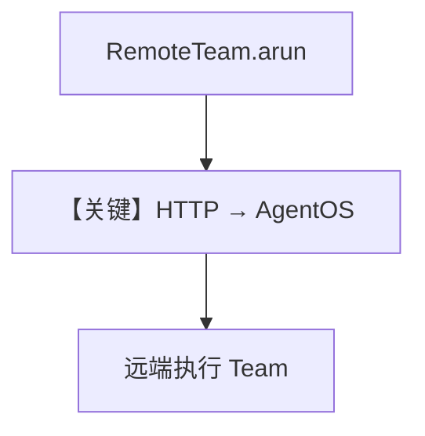

# remote_team.py — 实现原理分析

> 源文件：`cookbook/03_teams/14_run_control/remote_team.py`

## 概述

本示例展示 **`RemoteTeam`**：不本地构造成员，而通过 HTTP 调用远端 AgentOS 上已部署的 `team_id`，支持 `arun` 与 `stream=True` 异步迭代。

**核心配置一览：**

| 配置项 | 值 |
|--------|-----|
| `base_url` | `http://localhost:7778` |
| `team_id` | `research-team` |

### 运行机制与因果链

本地无 `get_system_message`；请求体由远端服务组装。需捕获 `RemoteServerUnavailableError` 与网络异常。

## System Prompt 组装

**不适用**单一本地 Agent 的 `get_system_message`；提示词在远端 Team 定义处。

## 完整 API 请求

等价于对 `base_url` 的 REST/SSE 客户端调用（以 `RemoteTeam` 实现为准），而非直接 `openai` SDK。

## Mermaid 流程图

```mermaid
flowchart TD
    L["RemoteTeam.arun"] --> H["【关键】HTTP → AgentOS"]
    H --> R["远端执行 Team"]
```

## 关键源码文件索引

| 文件 | 作用 |
|------|------|
| `agno/team/remote_team.py`（或等价模块） | `RemoteTeam` |
