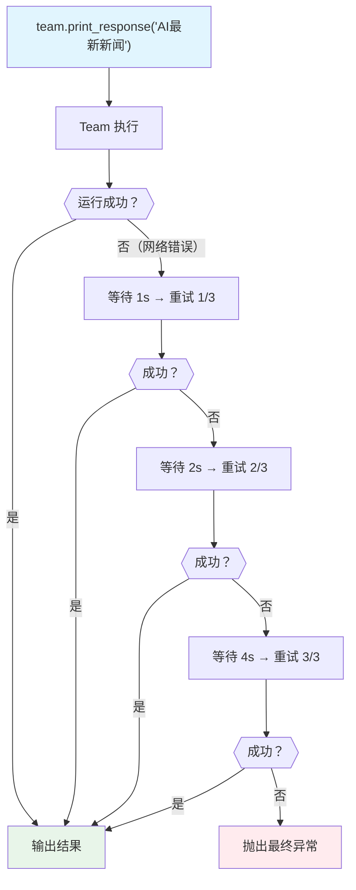

# retries.py — 实现原理分析

> 源文件：`cookbook/03_teams/14_run_control/retries.py`

## 概述

本示例展示 Agno Team 的 **`retries` 重试配置**：配置 `retries=3`（最多重试3次）、`delay_between_retries=1`（重试间隔1秒）和 `exponential_backoff=True`（指数退避）。当 Team 运行遇到瞬时错误（网络超时、API 限流等）时，自动按配置重试而不是立即失败。

**核心配置一览：**

| 配置项 | 值 | 说明 |
|--------|------|------|
| `retries` | `3` | 最大重试次数 |
| `delay_between_retries` | `1` | 首次重试等待秒数 |
| `exponential_backoff` | `True` | 每次重试加倍等待时间 |

## 核心组件解析

### 指数退避策略

```
第1次失败 → 等待 1 秒 → 重试
第2次失败 → 等待 2 秒 → 重试
第3次失败 → 等待 4 秒 → 重试
第4次失败 → 抛出最终异常
```

`exponential_backoff=True` 将每次等待时间翻倍，避免在 API 限流时密集重试加重压力。

### 重试的触发条件

- API 网络超时
- HTTP 5xx 错误
- 速率限制（429 Too Many Requests）
- 连接重置

不会重试：
- 认证失败（401）
- 内容违规（400）
- 业务逻辑错误

### 工具搜索的重试价值

`WebSearchTools` 等网络工具存在随机超时风险，重试配置提供了优雅的容错机制，无需在业务代码中手动实现重试逻辑。

## Mermaid 流程图



## 关键源码文件索引

| 文件 | 关键函数/类 | 作用 |
|------|------------|------|
| `agno/team/team.py` | `retries`, `delay_between_retries`, `exponential_backoff` | 重试配置 |
