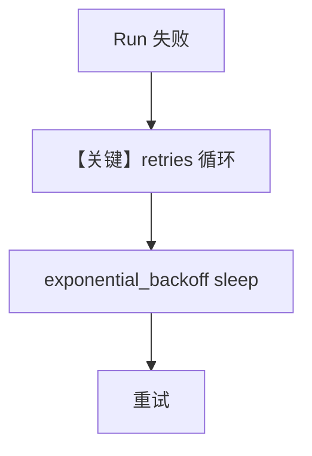

# retries.py — 实现原理分析

<!-- cookbook-py-source:start -->
## 完整源码

```python
"""
Retries
=============================

Demonstrates team retry configuration for transient run errors.
"""

from agno.agent import Agent
from agno.team import Team
from agno.tools.websearch import WebSearchTools

# ---------------------------------------------------------------------------
# Create Members
# ---------------------------------------------------------------------------
sarah = Agent(
    name="Sarah",
    role="Data Researcher",
    tools=[WebSearchTools()],
    instructions="Focus on gathering and analyzing data",
)

mike = Agent(
    name="Mike",
    role="Technical Writer",
    instructions="Create clear, concise summaries",
)

# ---------------------------------------------------------------------------
# Create Team
# ---------------------------------------------------------------------------
team = Team(
    members=[sarah, mike],
    retries=3,
    delay_between_retries=1,
    exponential_backoff=True,
)

# ---------------------------------------------------------------------------
# Run Team
# ---------------------------------------------------------------------------
if __name__ == "__main__":
    team.print_response(
        "Search for latest news about the latest AI models",
        stream=True,
    )
```

<!-- cookbook-py-source:end -->

> 源文件：`cookbook/03_teams/14_run_control/retries.py`

## 概述

本示例展示 Team 的 **`retries` / `delay_between_retries` / `exponential_backoff`**：在瞬时模型/网络错误时自动重试整个 run（具体语义以 `_run` 实现为准）。

**核心配置一览：**

| 配置项 | 值 |
|--------|-----|
| `retries` | `3` |
| `delay_between_retries` | `1` |
| `exponential_backoff` | `True` |
| `members` | Sarah（WebSearch）+ Mike |
| 父 `model` | 未显式（运行时将经默认解析） |

## 运行机制与因果链

失败时按退避策略 sleep 后重试；成功则返回。与「成员级重试」区分：此处为 **Team 级** 配置。

## System Prompt 组装

默认 Team；成员带 `WebSearchTools`。

## Mermaid 流程图


```mermaid
flowchart TD
    R["Run 失败"] --> T["【关键】retries 循环"]
    T --> B["exponential_backoff sleep"]
    B --> R2["重试"]
```

## 关键源码文件索引

| 文件 | 作用 |
|------|------|
| `agno/team/team.py` | `retries` 等字段 |
| `agno/team/_run.py` | 重试逻辑 |
