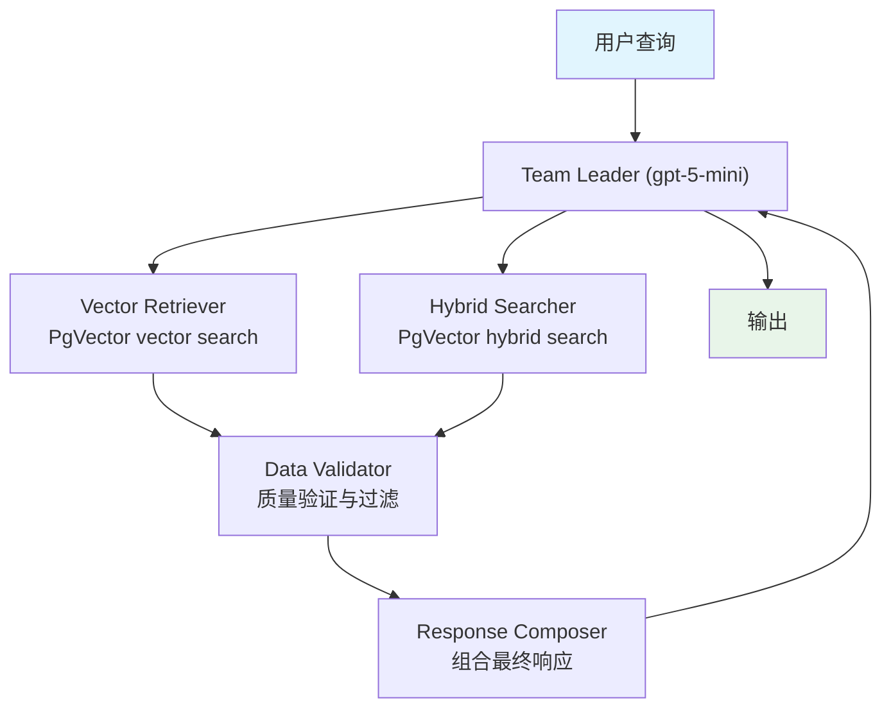

# 01_distributed_rag_pgvector.py — 实现原理分析

> 源文件：`cookbook/03_teams/15_distributed_rag/01_distributed_rag_pgvector.py`

## 概述

本示例展示基于 **PgVector 的分布式 RAG Team**：4 个专责成员各自承担 RAG 流程的一个阶段——向量检索（`SearchType.vector`）、混合检索（`SearchType.hybrid`）、数据验证、响应组合。不同成员挂载不同的 `Knowledge` 实例，通过 Team Leader 协调串联，实现企业级精度的多阶段检索。

**核心配置一览：**

| 成员 | 知识库 | 检索类型 |
|------|--------|---------|
| Vector Retriever | `recipes_vector` (PgVector) | `SearchType.vector` |
| Hybrid Searcher | `recipes_hybrid` (PgVector) | `SearchType.hybrid` |
| Data Validator | 无 | 评估质量 |
| Response Composer | 无 | 组合最终响应 |

## 核心组件解析

### 双知识库分工

```python
vector_knowledge = Knowledge(
    vector_db=PgVector(
        table_name="recipes_vector",
        search_type=SearchType.vector,       # 纯向量相似度
        embedder=OpenAIEmbedder(...),
    ),
)

hybrid_knowledge = Knowledge(
    vector_db=PgVector(
        table_name="recipes_hybrid",
        search_type=SearchType.hybrid,       # 向量 + 文本联合
        embedder=OpenAIEmbedder(...),
    ),
)
```

两种检索互补：向量搜索捕捉语义相关性，混合搜索兼顾关键词精确匹配。

### 知识写入

```python
# 同步写入
vector_knowledge.insert_many(url="https://...ThaiRecipes.pdf")
hybrid_knowledge.insert_many(url="https://...ThaiRecipes.pdf")

# 异步写入
await vector_knowledge.ainsert_many(url="...")
await hybrid_knowledge.ainsert_many(url="...")
```

### 无知识库的纯推理成员

`Data Validator` 和 `Response Composer` 不挂载 `knowledge`，仅依赖其他成员传递的信息进行验证和组合，实现职责分离。

## Mermaid 流程图



## 关键源码文件索引

| 文件 | 关键函数/类 | 作用 |
|------|------------|------|
| `agno/knowledge/knowledge.py` | `Knowledge`, `insert_many`, `ainsert_many` | 知识库写入 |
| `agno/vectordb/pgvector.py` | `PgVector`, `SearchType` | PgVector 向量数据库 |
