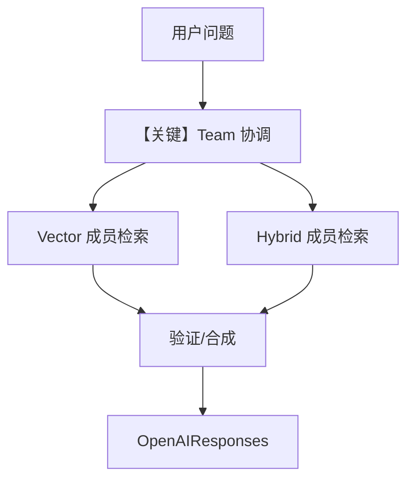

# 01_distributed_rag_pgvector.py — 实现原理分析

> 源文件：`cookbook/03_teams/15_distributed_rag/01_distributed_rag_pgvector.py`

## 概述

本示例展示 **Team 分布式 RAG（PostgreSQL + pgvector）**：两名成员分别挂载 **纯向量** 与 **hybrid** 检索的 `Knowledge`（同库不同表），另设验证与汇总角色，队长按流水线协调；运行前向两张表灌入同一 PDF 菜谱数据。

**核心配置一览：**

| 配置项 | 值 | 说明 |
|--------|------|------|
| `vector_knowledge` | `PgVector(table_name="recipes_vector", search_type=vector)` | 成员 Vector Retriever |
| `hybrid_knowledge` | `PgVector(table_name="recipes_hybrid", search_type=hybrid)` | 成员 Hybrid Searcher |
| `distributed_pgvector_team` | `OpenAIResponses(gpt-5-mini)`，四成员 | 队长协调 |
| `show_members_responses` | `True` | 展示成员输出 |
| `db`（Team 级） | `None` | 知识走 PgVector URL，会话未强制 |

## 架构分层

```
cookbook 层          agno.team + knowledge
┌────────────────┐    ┌──────────────────────────────┐
│ insert_many PDF │──▶│ Knowledge → PgVector 表    │
│ print_response  │──▶│ Team coordinate + 成员 RAG  │
└────────────────┘    └──────────────────────────────┘
                              │
                              ▼
                    OpenAIResponses（gpt-5-mini）
```

## 核心组件解析

### 成员侧 RAG

各 `Agent` 设 `knowledge=` 与 `search_knowledge=True`，由 Agent 的 `get_system_message` / 工具链触发检索（与 Team 队长拼装独立）。

### Team 流水线指令

队长 `instructions`（L106-114）规定：先向量、再 hybrid、再校验、最后合成。

### 运行机制与因果链

1. **数据**：`insert_many(url=ThaiRecipes.pdf)` 写入两表 → 查询时两路检索互补。
2. **路径**：用户问题 → 队长多轮委托 → 成员各自 `search_knowledge` → 汇总。
3. **环境**：需本地 Postgres+pgvector（脚本提示 `./cookbook/run_pgvector.sh`）。

## System Prompt 组装

- **队长**：默认 Team 模板 + L106-114 的 `instructions` 全文（须从 `.py` 原样复制到还原块）。
- **成员**：各自 `instructions` + Knowledge 注入的检索说明（见 `agno/knowledge` 与 Agent `_messages`）。

### 还原后的完整 System 文本（队长 instructions 字面）

```text
Work together to provide comprehensive RAG responses using PostgreSQL pgvector.
Vector Retriever: First perform vector similarity search.
Hybrid Searcher: Then perform hybrid search for comprehensive coverage.
Data Validator: Validate and filter the retrieved information quality.
Response Composer: Compose the final response with proper attribution.
Leverage PostgreSQL's scalability and pgvector's performance.
Ensure enterprise-grade reliability and accuracy.
```

## 完整 API 请求

```python
client.responses.create(
    model="gpt-5-mini",
    input=formatted_input,
    tools=knowledge_and_team_tools,
)
```

## Mermaid 流程图


```mermaid
flowchart TD
    U["用户问题"] --> T["【关键】Team 协调"]
    T --> V["Vector 成员检索"]
    T --> H["Hybrid 成员检索"]
    V --> S["验证/合成"]
    H --> S
    S --> M["OpenAIResponses"]
```

## 关键源码文件索引

| 文件 | 作用 |
|------|------|
| `agno/team/_messages.py` | `get_system_message`（队长） |
| `agno/knowledge/knowledge.py` | `Knowledge.insert_many` |
| `agno/vectordb/pgvector/` | `PgVector` |
