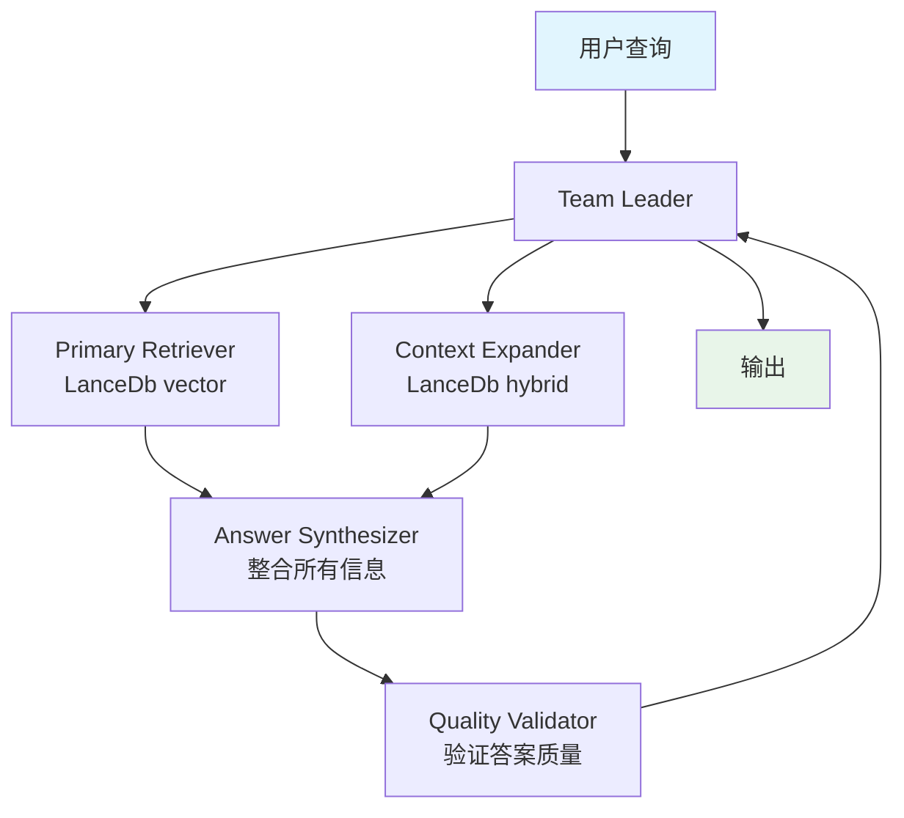

# 02_distributed_rag_lancedb.py — 实现原理分析

> 源文件：`cookbook/03_teams/15_distributed_rag/02_distributed_rag_lancedb.py`

## 概述

本示例展示基于 **LanceDB 的分布式 RAG Team**：Primary Retriever 负责核心精准检索，Context Expander 扩展相关背景信息，Answer Synthesizer 整合两路结果，Quality Validator 最终验证答案质量。LanceDB 作为本地文件型向量数据库，无需额外服务，适合快速原型。

**核心配置一览：**

| 成员 | 知识库 | 检索类型 |
|------|--------|---------|
| Primary Retriever | `recipes_primary` (LanceDb) | `SearchType.vector` |
| Context Expander | `recipes_context` (LanceDb) | `SearchType.hybrid` |
| Answer Synthesizer | 无 | 信息综合 |
| Quality Validator | 无 | 质量验证 |

## 核心组件解析

### 主检索 vs 上下文扩展

```python
primary_knowledge = Knowledge(
    vector_db=LanceDb(
        table_name="recipes_primary",
        uri="tmp/lancedb",
        search_type=SearchType.vector,    # 精准语义匹配
        embedder=OpenAIEmbedder(...),
    ),
)

context_knowledge = Knowledge(
    vector_db=LanceDb(
        table_name="recipes_context",
        uri="tmp/lancedb",
        search_type=SearchType.hybrid,   # 扩展背景上下文
        embedder=OpenAIEmbedder(...),
    ),
)
```

两张表存储相同数据但检索策略不同：一张精准、一张广泛。

### LanceDB vs PgVector

| 特性 | LanceDB | PgVector |
|------|---------|---------|
| 部署 | 本地文件（`tmp/lancedb`） | PostgreSQL 服务 |
| 适用 | 原型、单机 | 生产、多实例 |
| 依赖 | 无额外服务 | 需运行 PostgreSQL |

### 同步与异步两种运行方式

```python
# 异步
await distributed_rag_team.aprint_response(input=query)

# 同步
distributed_rag_team.print_response(input=query)
```

## Mermaid 流程图



## 关键源码文件索引

| 文件 | 关键函数/类 | 作用 |
|------|------------|------|
| `agno/vectordb/lancedb.py` | `LanceDb`, `SearchType` | LanceDB 向量数据库 |
| `agno/knowledge/knowledge.py` | `Knowledge` | 知识库封装 |
