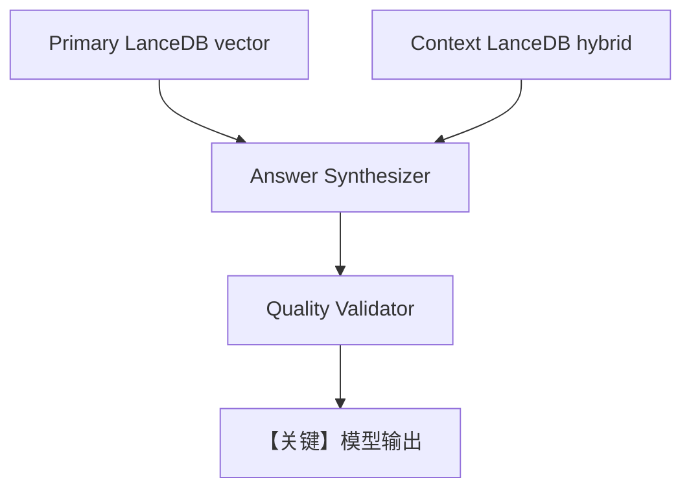

# 02_distributed_rag_lancedb.py — 实现原理分析

<!-- cookbook-py-source:start -->
## 完整源码

```python
"""
Distributed RAG With LanceDB
============================

Demonstrates distributed team-based RAG with primary and context retrieval over LanceDB.
"""

import asyncio

from agno.agent import Agent
from agno.knowledge.embedder.openai import OpenAIEmbedder
from agno.knowledge.knowledge import Knowledge
from agno.models.openai import OpenAIResponses
from agno.team import Team
from agno.vectordb.lancedb import LanceDb, SearchType

# ---------------------------------------------------------------------------
# Setup
# ---------------------------------------------------------------------------
primary_knowledge = Knowledge(
    vector_db=LanceDb(
        table_name="recipes_primary",
        uri="tmp/lancedb",
        search_type=SearchType.vector,
        embedder=OpenAIEmbedder(id="text-embedding-3-small"),
    ),
)

context_knowledge = Knowledge(
    vector_db=LanceDb(
        table_name="recipes_context",
        uri="tmp/lancedb",
        search_type=SearchType.hybrid,
        embedder=OpenAIEmbedder(id="text-embedding-3-small"),
    ),
)

# ---------------------------------------------------------------------------
# Create Members
# ---------------------------------------------------------------------------
primary_retriever = Agent(
    name="Primary Retriever",
    model=OpenAIResponses(id="gpt-5-mini"),
    role="Retrieve primary documents and core information from knowledge base",
    knowledge=primary_knowledge,
    search_knowledge=True,
    instructions=[
        "Search the knowledge base for directly relevant information to the user's query.",
        "Focus on retrieving the most relevant and specific documents first.",
        "Provide detailed information with proper context.",
        "Ensure accuracy and completeness of retrieved information.",
    ],
    markdown=True,
)

context_expander = Agent(
    name="Context Expander",
    model=OpenAIResponses(id="gpt-5-mini"),
    role="Expand context by finding related and supplementary information",
    knowledge=context_knowledge,
    search_knowledge=True,
    instructions=[
        "Find related information that complements the primary retrieval.",
        "Look for background context, related topics, and supplementary details.",
        "Search for information that helps understand the broader context.",
        "Identify connections between different pieces of information.",
    ],
    markdown=True,
)

answer_synthesizer = Agent(
    name="Answer Synthesizer",
    model=OpenAIResponses(id="gpt-5-mini"),
    role="Synthesize retrieved information into comprehensive answers",
    instructions=[
        "Combine information from the Primary Retriever and Context Expander.",
        "Create a comprehensive, well-structured response.",
        "Ensure logical flow and coherence in the final answer.",
        "Include relevant details while maintaining clarity.",
        "Organize information in a user-friendly format.",
    ],
    markdown=True,
)

quality_validator = Agent(
    name="Quality Validator",
    model=OpenAIResponses(id="gpt-5-mini"),
    role="Validate answer quality and suggest improvements",
    instructions=[
        "Review the synthesized answer for accuracy and completeness.",
        "Check if the answer fully addresses the user's query.",
        "Identify any gaps or areas that need clarification.",
        "Suggest improvements or additional information if needed.",
        "Ensure the response meets high quality standards.",
    ],
    markdown=True,
)

# ---------------------------------------------------------------------------
# Create Team
# ---------------------------------------------------------------------------
distributed_rag_team = Team(
    name="Distributed RAG Team",
    model=OpenAIResponses(id="gpt-5-mini"),
    members=[
        primary_retriever,
        context_expander,
        answer_synthesizer,
        quality_validator,
    ],
    instructions=[
        "Work together to provide comprehensive, high-quality RAG responses.",
        "Primary Retriever: First retrieve core relevant information.",
        "Context Expander: Then expand with related context and background.",
        "Answer Synthesizer: Synthesize all information into a comprehensive answer.",
        "Quality Validator: Finally validate and suggest any improvements.",
        "Ensure all responses are accurate, complete, and well-structured.",
    ],
    show_members_responses=True,
    markdown=True,
)


# ---------------------------------------------------------------------------
# Run Team
# ---------------------------------------------------------------------------
async def async_distributed_rag_demo() -> None:
    """Demonstrate async distributed RAG processing."""
    print("Async Distributed RAG with LanceDB Demo")
    print("=" * 50)

    query = "How do I make chicken and galangal in coconut milk soup? Include cooking tips and variations."

    await primary_knowledge.ainsert_many(
        url="https://agno-public.s3.amazonaws.com/recipes/ThaiRecipes.pdf"
    )
    await context_knowledge.ainsert_many(
        url="https://agno-public.s3.amazonaws.com/recipes/ThaiRecipes.pdf"
    )

    await distributed_rag_team.aprint_response(input=query)


def sync_distributed_rag_demo() -> None:
    """Demonstrate sync distributed RAG processing."""
    print("Distributed RAG with LanceDB Demo")
    print("=" * 40)

    query = "How do I make chicken and galangal in coconut milk soup? Include cooking tips and variations."

    primary_knowledge.insert_many(
        url="https://agno-public.s3.amazonaws.com/recipes/ThaiRecipes.pdf"
    )
    context_knowledge.insert_many(
        url="https://agno-public.s3.amazonaws.com/recipes/ThaiRecipes.pdf"
    )

    distributed_rag_team.print_response(input=query)


def multi_course_meal_demo() -> None:
    """Demonstrate distributed RAG for complex multi-part queries."""
    print("Multi-Course Meal Planning with Distributed RAG")
    print("=" * 55)

    query = """Hi, I want to make a 3 course Thai meal. Can you recommend some recipes?
    I'd like to start with a soup, then a thai curry for the main course and finish with a dessert.
    Please include cooking techniques and any special tips."""

    primary_knowledge.insert_many(
        url="https://agno-public.s3.amazonaws.com/recipes/ThaiRecipes.pdf"
    )
    context_knowledge.insert_many(
        url="https://agno-public.s3.amazonaws.com/recipes/ThaiRecipes.pdf"
    )

    distributed_rag_team.print_response(input=query)


if __name__ == "__main__":
    # Choose which demo to run
    asyncio.run(async_distributed_rag_demo())

    # multi_course_meal_demo()

    # sync_distributed_rag_demo()
```

<!-- cookbook-py-source:end -->

> 源文件：`cookbook/03_teams/15_distributed_rag/02_distributed_rag_lancedb.py`

## 概述

本示例展示 **LanceDB 上的「主检索 + 上下文扩展」双知识库 Team RAG**：`primary_knowledge` 用 `SearchType.vector`，`context_knowledge` 用 `hybrid`，成员分工检索后由 Answer Synthesizer 与 Quality Validator 串联。

**核心配置一览：**

| 配置项 | 值 |
|--------|-----|
| `uri` | `tmp/lancedb`（两表：`recipes_primary` / `recipes_context`） |
| `embedder` | `OpenAIEmbedder(text-embedding-3-small)` |
| 队长 `model` | `OpenAIResponses(gpt-5-mini)` |

## 运行机制与因果链

与 pgvector 版类似，差异在 **嵌入式向量库 LanceDB** 与 **主从检索策略**；`insert_many` 灌库后 `print_response`/`aprint_response` 驱动委托。

## System Prompt 组装

队长与各成员 `instructions` 见 `.py` 中 Team 与 Agent 构造；还原须复制字面量。

## 完整 API 请求

`OpenAIResponses` → `responses.create`。

## Mermaid 流程图


```mermaid
flowchart TD
    P["Primary LanceDB vector"] --> S["Answer Synthesizer"]
    C["Context LanceDB hybrid"] --> S
    S --> Q["Quality Validator"]
    Q --> M["【关键】模型输出"]
```

## 关键源码文件索引

| 文件 | 作用 |
|------|------|
| `agno/vectordb/lancedb/` | `LanceDb` |
