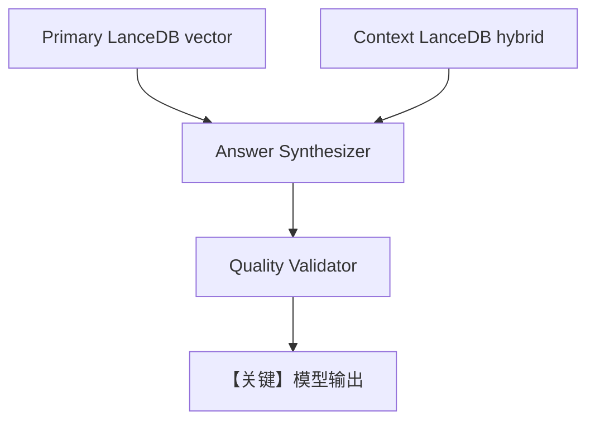

# 02_distributed_rag_lancedb.py — 实现原理分析

> 源文件：`cookbook/03_teams/15_distributed_rag/02_distributed_rag_lancedb.py`

## 概述

本示例展示 **LanceDB 上的「主检索 + 上下文扩展」双知识库 Team RAG**：`primary_knowledge` 用 `SearchType.vector`，`context_knowledge` 用 `hybrid`，成员分工检索后由 Answer Synthesizer 与 Quality Validator 串联。

**核心配置一览：**

| 配置项 | 值 |
|--------|-----|
| `uri` | `tmp/lancedb`（两表：`recipes_primary` / `recipes_context`） |
| `embedder` | `OpenAIEmbedder(text-embedding-3-small)` |
| 队长 `model` | `OpenAIResponses(gpt-5-mini)` |

## 运行机制与因果链

与 pgvector 版类似，差异在 **嵌入式向量库 LanceDB** 与 **主从检索策略**；`insert_many` 灌库后 `print_response`/`aprint_response` 驱动委托。

## System Prompt 组装

队长与各成员 `instructions` 见 `.py` 中 Team 与 Agent 构造；还原须复制字面量。

## 完整 API 请求

`OpenAIResponses` → `responses.create`。

## Mermaid 流程图

```mermaid
flowchart TD
    P["Primary LanceDB vector"] --> S["Answer Synthesizer"]
    C["Context LanceDB hybrid"] --> S
    S --> Q["Quality Validator"]
    Q --> M["【关键】模型输出"]
```

## 关键源码文件索引

| 文件 | 作用 |
|------|------|
| `agno/vectordb/lancedb/` | `LanceDb` |
