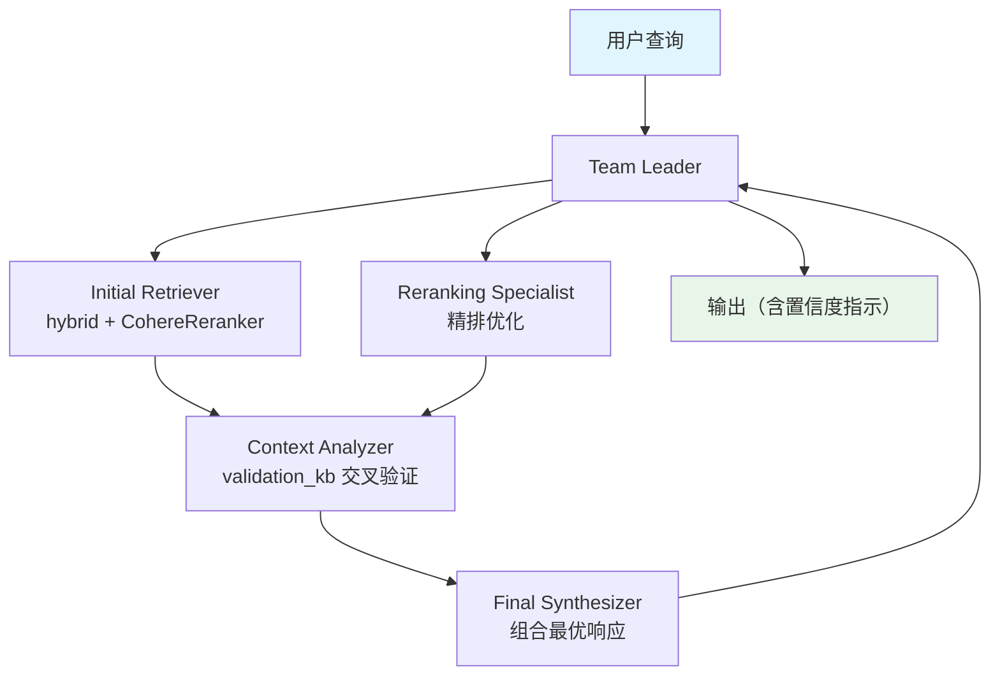

# 03_distributed_rag_with_reranking.py — 实现原理分析

> 源文件：`cookbook/03_teams/15_distributed_rag/03_distributed_rag_with_reranking.py`

## 概述

本示例展示 **带 Cohere Reranking 的分布式 RAG Team**：Initial Retriever 广泛召回，Reranking Specialist 用 Cohere `rerank-v3.5` 精排，Context Analyzer 交叉验证，Final Synthesizer 组合最终答案。Reranking 在向量检索和 LLM 生成之间插入精确排序层，大幅提升相关性。

**核心配置一览：**

| 配置项 | 值 | 说明 |
|--------|------|------|
| `reranker` | `CohereReranker(model="rerank-v3.5")` | 精排模型 |
| 主知识库 | `recipes_reranked` (hybrid + rerank) | 广泛召回后精排 |
| 验证知识库 | `recipes_validation` (vector) | 交叉验证用 |

## 核心组件解析

### Reranking 集成方式

```python
reranked_knowledge = Knowledge(
    vector_db=LanceDb(
        table_name="recipes_reranked",
        search_type=SearchType.hybrid,
        embedder=OpenAIEmbedder(id="text-embedding-3-small"),
        reranker=CohereReranker(model="rerank-v3.5"),  # 关键：精排
    ),
)
```

`reranker` 参数直接挂在 `LanceDb` 上，检索后自动对候选文档排序，无需在 Agent 层处理。

### 两阶段检索策略

```
阶段1（Initial Retriever）：高召回，宽泛检索
  → hybrid search → Cohere rerank → Top-K 精排结果

阶段2（Reranking Specialist）：同库再次精确查询
  → 关注排序质量而非数量

阶段3（Context Analyzer）：validation_knowledge 交叉验证
  → 确保信息准确性
```

### 独立工具函数调用

```python
# 使用模块级工具函数（非 team 方法）
from agno.utils.print_response.team import aprint_response, print_response
await aprint_response(input=query, team=distributed_reranking_team)
print_response(distributed_reranking_team, query)
```

## Mermaid 流程图



## 关键源码文件索引

| 文件 | 关键函数/类 | 作用 |
|------|------------|------|
| `agno/knowledge/reranker/cohere.py` | `CohereReranker` | Cohere 精排集成 |
| `agno/vectordb/lancedb.py` | `LanceDb(reranker=...)` | 向量库精排配置 |
| `agno/utils/print_response/team.py` | `aprint_response`, `print_response` | 独立工具函数 |
