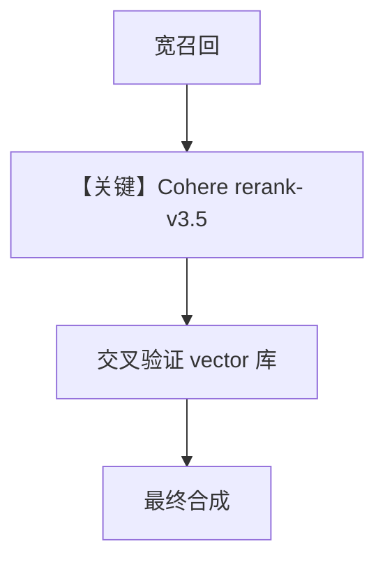

# 03_distributed_rag_with_reranking.py — 实现原理分析

<!-- cookbook-py-source:start -->
## 完整源码

```python
"""
Distributed RAG With Reranking
==============================

Demonstrates distributed RAG with hybrid retrieval and Cohere reranking.
"""

import asyncio

from agno.agent import Agent
from agno.knowledge.embedder.openai import OpenAIEmbedder
from agno.knowledge.knowledge import Knowledge
from agno.knowledge.reranker.cohere import CohereReranker
from agno.models.openai import OpenAIResponses
from agno.team import Team
from agno.utils.print_response.team import aprint_response, print_response
from agno.vectordb.lancedb import LanceDb, SearchType

# ---------------------------------------------------------------------------
# Setup
# ---------------------------------------------------------------------------
reranked_knowledge = Knowledge(
    vector_db=LanceDb(
        table_name="recipes_reranked",
        uri="tmp/lancedb",
        search_type=SearchType.hybrid,
        embedder=OpenAIEmbedder(id="text-embedding-3-small"),
        reranker=CohereReranker(model="rerank-v3.5"),
    ),
)

validation_knowledge = Knowledge(
    vector_db=LanceDb(
        table_name="recipes_validation",
        uri="tmp/lancedb",
        search_type=SearchType.vector,
        embedder=OpenAIEmbedder(id="text-embedding-3-small"),
    ),
)

# ---------------------------------------------------------------------------
# Create Members
# ---------------------------------------------------------------------------
initial_retriever = Agent(
    name="Initial Retriever",
    model=OpenAIResponses(id="gpt-5-mini"),
    role="Perform broad initial retrieval to gather candidate information",
    knowledge=reranked_knowledge,
    search_knowledge=True,
    instructions=[
        "Perform comprehensive initial retrieval from the knowledge base.",
        "Cast a wide net to gather all potentially relevant information.",
        "Focus on recall rather than precision in this initial phase.",
        "Retrieve diverse content that might be relevant to the query.",
    ],
    markdown=True,
)

reranking_specialist = Agent(
    name="Reranking Specialist",
    model=OpenAIResponses(id="gpt-5-mini"),
    role="Apply advanced reranking to optimize retrieval results",
    knowledge=reranked_knowledge,
    search_knowledge=True,
    instructions=[
        "Apply advanced reranking techniques to optimize result relevance.",
        "Focus on precision and ranking quality over quantity.",
        "Use the Cohere reranker to identify the most relevant content.",
        "Prioritize results that best match the user's specific needs.",
    ],
    markdown=True,
)

context_analyzer = Agent(
    name="Context Analyzer",
    model=OpenAIResponses(id="gpt-5-mini"),
    role="Analyze context and relevance of reranked results",
    knowledge=validation_knowledge,
    search_knowledge=True,
    instructions=[
        "Analyze the context and relevance of reranked results.",
        "Cross-validate information against the validation knowledge base.",
        "Assess the quality and accuracy of retrieved content.",
        "Identify the most contextually appropriate information.",
    ],
    markdown=True,
)

final_synthesizer = Agent(
    name="Final Synthesizer",
    model=OpenAIResponses(id="gpt-5-mini"),
    role="Synthesize reranked results into optimal comprehensive responses",
    instructions=[
        "Synthesize information from all team members into optimal responses.",
        "Leverage the reranked and analyzed results for maximum quality.",
        "Create responses that demonstrate the benefits of advanced reranking.",
        "Ensure optimal information organization and presentation.",
        "Include confidence levels and source quality indicators.",
    ],
    markdown=True,
)

# ---------------------------------------------------------------------------
# Create Team
# ---------------------------------------------------------------------------
distributed_reranking_team = Team(
    name="Distributed Reranking RAG Team",
    model=OpenAIResponses(id="gpt-5-mini"),
    members=[
        initial_retriever,
        reranking_specialist,
        context_analyzer,
        final_synthesizer,
    ],
    instructions=[
        "Work together to provide optimal RAG responses using advanced reranking.",
        "Initial Retriever: First perform broad comprehensive retrieval.",
        "Reranking Specialist: Apply advanced reranking for result optimization.",
        "Context Analyzer: Analyze and validate the reranked results.",
        "Final Synthesizer: Create optimal responses from reranked information.",
        "Leverage advanced reranking for superior result quality.",
        "Demonstrate the benefits of specialized reranking in team coordination.",
    ],
    show_members_responses=True,
    markdown=True,
)


# ---------------------------------------------------------------------------
# Run Team
# ---------------------------------------------------------------------------
async def async_reranking_rag_demo() -> None:
    """Demonstrate async distributed reranking RAG processing."""
    print("Async Distributed Reranking RAG Demo")
    print("=" * 45)

    query = "What's the best way to prepare authentic Tom Kha Gai? I want traditional methods and modern variations."

    await reranked_knowledge.ainsert_many(
        url="https://agno-public.s3.amazonaws.com/recipes/ThaiRecipes.pdf"
    )
    await validation_knowledge.ainsert_many(
        url="https://agno-public.s3.amazonaws.com/recipes/ThaiRecipes.pdf"
    )

    await aprint_response(input=query, team=distributed_reranking_team)


def sync_reranking_rag_demo() -> None:
    """Demonstrate sync distributed reranking RAG processing."""
    print("Distributed Reranking RAG Demo")
    print("=" * 35)

    query = "What's the best way to prepare authentic Tom Kha Gai? I want traditional methods and modern variations."

    reranked_knowledge.insert_many(
        url="https://agno-public.s3.amazonaws.com/recipes/ThaiRecipes.pdf"
    )
    validation_knowledge.insert_many(
        url="https://agno-public.s3.amazonaws.com/recipes/ThaiRecipes.pdf"
    )

    print_response(distributed_reranking_team, query)


def advanced_culinary_demo() -> None:
    """Demonstrate advanced reranking for complex culinary queries."""
    print("Advanced Culinary Analysis with Reranking RAG")
    print("=" * 55)

    query = """I want to understand the science behind Thai curry pastes. Can you explain:
    - Traditional preparation methods vs modern techniques
    - How different ingredients affect flavor profiles
    - Regional variations and their historical origins
    - Best practices for storage and usage
    - How to adapt recipes for different dietary needs"""

    reranked_knowledge.insert_many(
        url="https://agno-public.s3.amazonaws.com/recipes/ThaiRecipes.pdf"
    )
    validation_knowledge.insert_many(
        url="https://agno-public.s3.amazonaws.com/recipes/ThaiRecipes.pdf"
    )

    print_response(distributed_reranking_team, query)


if __name__ == "__main__":
    # Choose which demo to run
    asyncio.run(async_reranking_rag_demo())

    # advanced_culinary_demo()

    # sync_reranking_rag_demo()
```

<!-- cookbook-py-source:end -->

> 源文件：`cookbook/03_teams/15_distributed_rag/03_distributed_rag_with_reranking.py`

## 概述

本示例展示 **Hybrid + Cohere Reranker** 的 LanceDB 知识库与 **多阶段成员分工**：`reranked_knowledge` 在 `LanceDb` 上配置 `reranker=CohereReranker(model="rerank-v3.5")`，强调先宽召回再精排；`validation_knowledge` 为独立 vector 表做交叉校验。

**核心配置一览：**

| 配置项 | 值 |
|--------|-----|
| `SearchType` | `hybrid`（带 reranker）/ `vector`（验证库） |
| `CohereReranker` | `rerank-v3.5` |
| 成员 | Initial Retriever / Reranking Specialist / Context Analyzer / Final Synthesizer |

## 运行机制与因果链

检索阶段由 **Reranker** 在向量库内部提升片段排序；成员指令强调 recall vs precision 分工。需有效 Cohere API 密钥（环境变量）。

## System Prompt 组装

默认 Team + 各 Agent `instructions`；无自定义 `team.system_message` 时走 `agno/team/_messages.py` 完整拼装。

## 完整 API 请求

主对话：`responses.create`；Rerank 可能额外调用 Cohere（在 `PgVector`/`LanceDb` 搜索路径内）。

## Mermaid 流程图


```mermaid
flowchart TD
    I["宽召回"] --> R["【关键】Cohere rerank-v3.5"]
    R --> A["交叉验证 vector 库"]
    A --> F["最终合成"]
```

## 关键源码文件索引

| 文件 | 作用 |
|------|------|
| `agno/knowledge/reranker/cohere.py` | `CohereReranker` |
