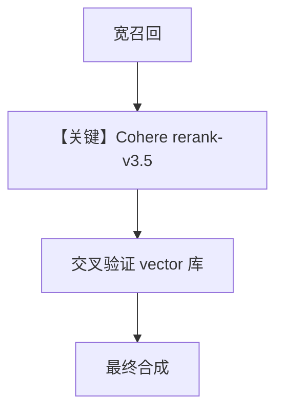

# 03_distributed_rag_with_reranking.py — 实现原理分析

> 源文件：`cookbook/03_teams/15_distributed_rag/03_distributed_rag_with_reranking.py`

## 概述

本示例展示 **Hybrid + Cohere Reranker** 的 LanceDB 知识库与 **多阶段成员分工**：`reranked_knowledge` 在 `LanceDb` 上配置 `reranker=CohereReranker(model="rerank-v3.5")`，强调先宽召回再精排；`validation_knowledge` 为独立 vector 表做交叉校验。

**核心配置一览：**

| 配置项 | 值 |
|--------|-----|
| `SearchType` | `hybrid`（带 reranker）/ `vector`（验证库） |
| `CohereReranker` | `rerank-v3.5` |
| 成员 | Initial Retriever / Reranking Specialist / Context Analyzer / Final Synthesizer |

## 运行机制与因果链

检索阶段由 **Reranker** 在向量库内部提升片段排序；成员指令强调 recall vs precision 分工。需有效 Cohere API 密钥（环境变量）。

## System Prompt 组装

默认 Team + 各 Agent `instructions`；无自定义 `team.system_message` 时走 `agno/team/_messages.py` 完整拼装。

## 完整 API 请求

主对话：`responses.create`；Rerank 可能额外调用 Cohere（在 `PgVector`/`LanceDb` 搜索路径内）。

## Mermaid 流程图

```mermaid
flowchart TD
    I["宽召回"] --> R["【关键】Cohere rerank-v3.5"]
    R --> A["交叉验证 vector 库"]
    A --> F["最终合成"]
```

## 关键源码文件索引

| 文件 | 作用 |
|------|------|
| `agno/knowledge/reranker/cohere.py` | `CohereReranker` |
