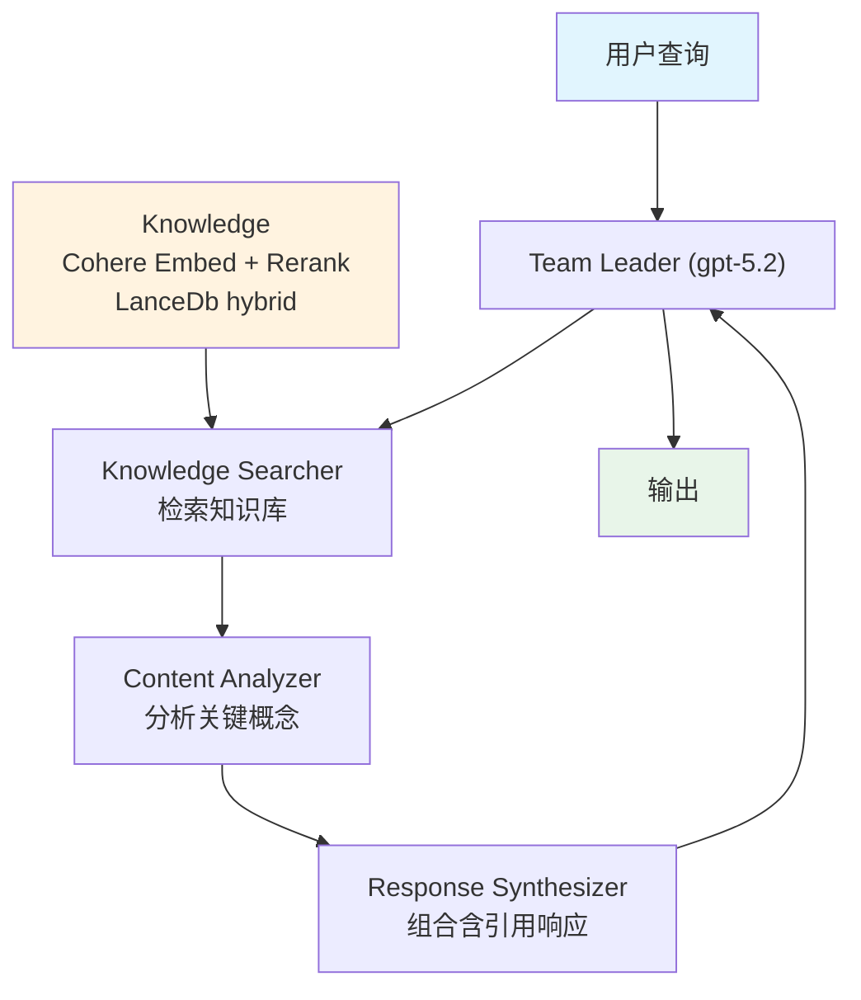

# 01_coordinated_agentic_rag.py — 实现原理分析

> 源文件：`cookbook/03_teams/16_search_coordination/01_coordinated_agentic_rag.py`

## 概述

本示例展示 **协作式 Agentic RAG Team**：共享同一个 `Knowledge`（Cohere Embed + Cohere Rerank + LanceDb hybrid），但角色分工明确——Knowledge Searcher 负责检索，Content Analyzer 负责分析，Response Synthesizer 负责组合引用。所有成员使用同一知识库，避免数据冗余。

**核心配置一览：**

| 配置项 | 值 | 说明 |
|--------|------|------|
| Embedder | `CohereEmbedder(id="embed-v4.0")` | Cohere 向量编码 |
| Reranker | `CohereReranker(model="rerank-v3.5")` | Cohere 精排 |
| 检索类型 | `SearchType.hybrid` | 混合检索 |
| 知识库 | 所有成员共享 | 单一知识源 |

## 核心组件解析

### 共享知识库设计

```python
knowledge = Knowledge(
    vector_db=LanceDb(
        uri="tmp/lancedb",
        table_name="agno_docs_team",
        search_type=SearchType.hybrid,
        embedder=CohereEmbedder(id="embed-v4.0"),
        reranker=CohereReranker(model="rerank-v3.5"),
    ),
)

# 只有 Knowledge Searcher 挂载 knowledge
knowledge_searcher = Agent(
    knowledge=knowledge,
    search_knowledge=True,
    ...
)
# Content Analyzer 和 Response Synthesizer 无 knowledge
```

单一知识源：Knowledge Searcher 检索后将结果传递给后续成员，避免多成员重复查询。

### 分工协作模式

```
Knowledge Searcher → 检索 + 提供原始文档
Content Analyzer  → 分析关键概念、识别关系
Response Synthesizer → 组合、加引用、格式化
```

### Cohere 全栈（Embed + Rerank）

同时使用 Cohere 的嵌入和精排，形成高质量的检索管道，适合对检索精度要求较高的场景。

## Mermaid 流程图



## 关键源码文件索引

| 文件 | 关键函数/类 | 作用 |
|------|------------|------|
| `agno/knowledge/embedder/cohere.py` | `CohereEmbedder` | Cohere 向量编码 |
| `agno/knowledge/reranker/cohere.py` | `CohereReranker` | Cohere 精排 |
| `agno/vectordb/lancedb.py` | `LanceDb` | 向量数据库 |
