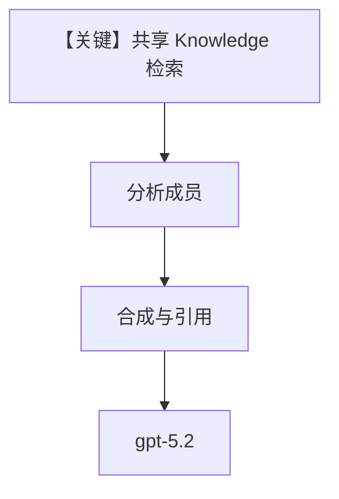

# 01_coordinated_agentic_rag.py — 实现原理分析

> 源文件：`cookbook/03_teams/16_search_coordination/01_coordinated_agentic_rag.py`

## 概述

本示例展示 **协调式 Agentic RAG**：共享 `Knowledge`（LanceDB hybrid + Cohere embed/rerank），三名成员分别负责 **检索 / 分析 / 带引用的终稿**，队长指令明确流水线顺序。

**核心配置一览：**

| 配置项 | 值 |
|--------|-----|
| `knowledge` | `LanceDb(uri=tmp/lancedb, table_name=agno_docs_team, hybrid, CohereEmbedder, CohereReranker)` |
| `knowledge.insert_many` | `docs.agno.com/agents/overview.md` |
| `coordinated_rag_team` | `gpt-5.2`，三成员，`show_members_responses=True` |

## 运行机制与因果链

单库多角色：依赖 **同一向量表** 的多次 agentic 检索与人工协调语义；查询示例 L101。

## System Prompt 组装

队长 `instructions` L82-88 须原样还原；成员各有 `instructions` 与 `search_knowledge` 行为。

### 还原后的完整 System 文本（队长）

```text
Work together to provide comprehensive responses using the knowledge base.
Knowledge Searcher: First search for relevant information thoroughly.
Content Analyzer: Then analyze and organize the retrieved content.
Response Synthesizer: Finally create a well-structured response with sources.
Ensure all responses include proper citations and are factually accurate.
```

## 完整 API 请求

`OpenAIResponses` → `responses.create`；嵌入/rerank 走 Cohere 与 Lance 管道。

## Mermaid 流程图


```mermaid
flowchart TD
    K["【关键】共享 Knowledge 检索"] --> A["分析成员"]
    A --> S["合成与引用"]
    S --> M["gpt-5.2"]
```

## 关键源码文件索引

| 文件 | 作用 |
|------|------|
| `agno/knowledge/knowledge.py` | 共享知识库 |
| `agno/team/_messages.py` | Team system |
