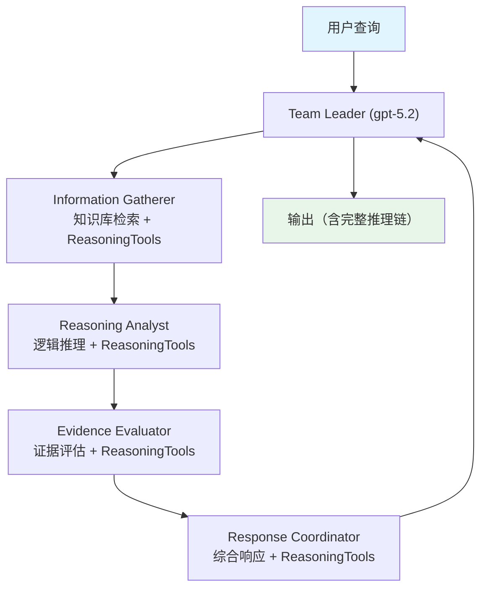

# 02_coordinated_reasoning_rag.py — 实现原理分析

> 源文件：`cookbook/03_teams/16_search_coordination/02_coordinated_reasoning_rag.py`

## 概述

本示例展示 **带推理工具的协调 RAG Team**：每个成员（Information Gatherer、Reasoning Analyst、Evidence Evaluator、Response Coordinator）都配备 `ReasoningTools(add_instructions=True)`，使 LLM 能够显式地规划、推理和评估信息。`show_full_reasoning=True` 让推理过程对用户透明可见。

**核心配置一览：**

| 配置项 | 值 | 说明 |
|--------|------|------|
| 所有成员工具 | `ReasoningTools(add_instructions=True)` | 结构化推理 |
| `show_full_reasoning` | `True` | 输出完整推理链 |
| 知识库 | 共享（仅 Information Gatherer 挂载） | 单一知识源 |

## 核心组件解析

### `ReasoningTools` 的作用

```python
tools=[ReasoningTools(add_instructions=True)]
```

`ReasoningTools` 提供 `think()` 和 `analyze()` 等工具，让 Agent 在回答前显式进行结构化推理，而非直接生成答案。`add_instructions=True` 自动在 Agent 的系统提示中添加使用指导。

### 推理链可见性

```python
coordinated_reasoning_team.print_response(
    query,
    stream=True,
    show_full_reasoning=True,  # 显示每个成员的推理过程
)
```

每个成员的 `think()` / `analyze()` 工具调用结果都会显示，形成完整的透明推理链。

### 四阶段推理分工

```
Information Gatherer → 搜索知识库，规划搜索策略
Reasoning Analyst   → 逻辑分析，识别关系与连接
Evidence Evaluator  → 评估证据质量，识别信息缺口
Response Coordinator → 综合所有成员贡献，形成最终响应
```

## Mermaid 流程图



## 关键源码文件索引

| 文件 | 关键函数/类 | 作用 |
|------|------------|------|
| `agno/tools/reasoning.py` | `ReasoningTools` | 结构化推理工具 |
| `agno/knowledge/reranker/cohere.py` | `CohereReranker` | Cohere 精排 |
