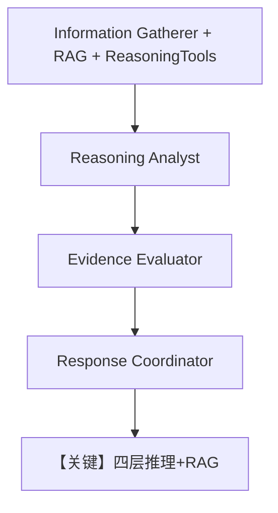

# 02_coordinated_reasoning_rag.py — 实现原理分析

> 源文件：`cookbook/03_teams/16_search_coordination/02_coordinated_reasoning_rag.py`

## 概述

本示例在 **协调 RAG** 之上为 **每名成员挂载 `ReasoningTools`**：在检索、分析、证据评估、终稿协调各阶段显式「可推理」，强化分步规划与透明推理链。

**核心配置一览：**

| 配置项 | 值 |
|--------|-----|
| `Knowledge` | LanceDB hybrid + Cohere embed + rerank，`table_name=agno_docs_reasoning_team` |
| 每成员 `tools` | `ReasoningTools(add_instructions=True)` |
| `model` | `OpenAIResponses(gpt-5.2)` |

## 运行机制与因果链

成员在自身 agent loop 内可调用 Reasoning 工具；Team 仍为 coordinate 模式汇总。

## System Prompt 组装

ReasoningTools 会向各成员注入额外工具说明；Team 级 `instructions` 见 `.py` 中 Team 构造。

## Mermaid 流程图

```mermaid
flowchart TD
    G["Information Gatherer + RAG + ReasoningTools"] --> A["Reasoning Analyst"]
    A --> E["Evidence Evaluator"]
    E --> C["Response Coordinator"]
    C --> Out["【关键】四层推理+RAG"]
```

## 关键源码文件索引

| 文件 | 作用 |
|------|------|
| `agno/tools/reasoning/` | `ReasoningTools` |
