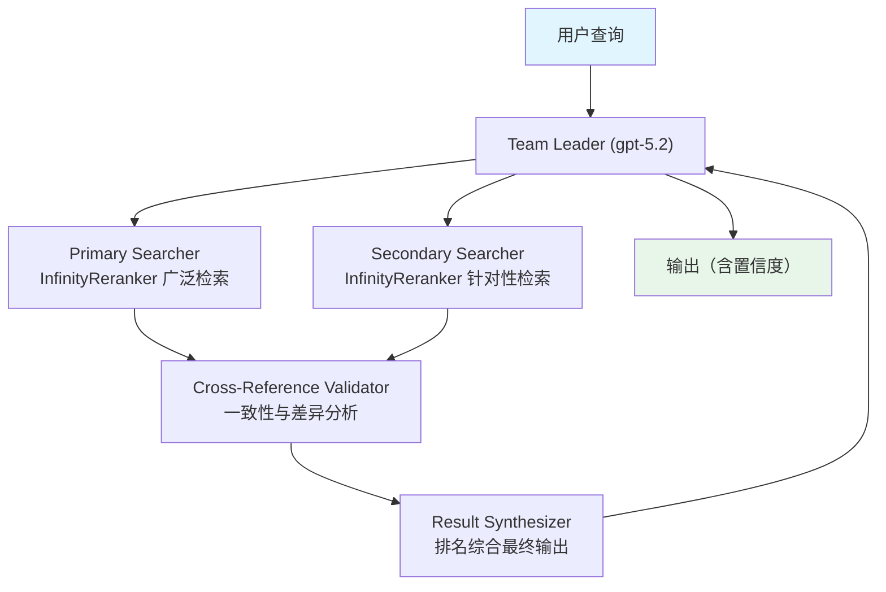

# 03_distributed_infinity_search.py — 实现原理分析

> 源文件：`cookbook/03_teams/16_search_coordination/03_distributed_infinity_search.py`

## 概述

本示例展示使用 **Infinity 自托管 Reranker 的分布式搜索 Team**：Primary Searcher 和 Secondary Searcher 各挂载独立的 `Knowledge`（均使用 `InfinityReranker` 精排），Cross-Reference Validator 交叉验证两路结果，Result Synthesizer 综合输出。Infinity 是可自部署的开源精排服务，适合私有化部署场景。

**核心配置一览：**

| 配置项 | 值 | 说明 |
|--------|------|------|
| Reranker | `InfinityReranker(base_url="http://localhost:7997/rerank", model="BAAI/bge-reranker-base")` | 自托管精排 |
| Embedder | `CohereEmbedder(id="embed-v4.0")` | Cohere 向量编码 |
| 检索类型 | `SearchType.hybrid` | 双路混合检索 |

## 核心组件解析

### Infinity Reranker 集成

```python
InfinityReranker(
    base_url="http://localhost:7997/rerank",
    model="BAAI/bge-reranker-base",
)
```

Infinity 是开源向量推理服务，`BAAI/bge-reranker-base` 是 BGE 系列精排模型。相比 Cohere 精排（云端 API），Infinity 支持完全私有化部署，适合数据安全要求高的场景。

### 启动 Infinity 服务

```bash
pip install 'infinity-emb[all]'
infinity_emb v2 --model-id BAAI/bge-reranker-base --port 7997
```

### 双路检索分工

| 成员 | 知识库 | 检索策略 |
|------|--------|---------|
| Primary Searcher | `agno_docs_primary` | 广泛搜索，高召回 |
| Secondary Searcher | `agno_docs_secondary` | 针对性搜索，边缘情况 |

两个知识库独立，虽然存储同一数据但可分别优化检索参数。

### 错误处理

```python
except Exception as e:
    print("Make sure Infinity server is running:")
    print("   pip install 'infinity-emb[all]'")
```

优雅提示用户启动依赖服务。

## Mermaid 流程图



## 关键源码文件索引

| 文件 | 关键函数/类 | 作用 |
|------|------------|------|
| `agno/knowledge/reranker/infinity.py` | `InfinityReranker` | 自托管精排集成 |
| `agno/knowledge/embedder/cohere.py` | `CohereEmbedder` | Cohere 向量编码 |
