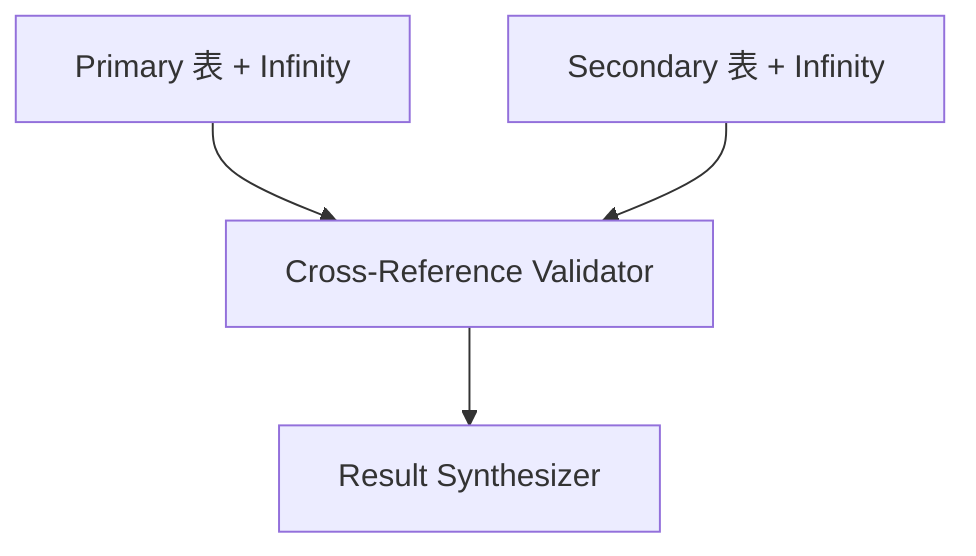

# 03_distributed_infinity_search.py — 实现原理分析

<!-- cookbook-py-source:start -->
## 完整源码

```python
"""
Distributed Infinity Search
===========================

Demonstrates distributed search coordination with Infinity reranking.
"""

from agno.agent import Agent
from agno.knowledge.embedder.cohere import CohereEmbedder
from agno.knowledge.knowledge import Knowledge
from agno.knowledge.reranker.infinity import InfinityReranker
from agno.models.openai import OpenAIResponses
from agno.team import Team
from agno.vectordb.lancedb import LanceDb, SearchType

# ---------------------------------------------------------------------------
# Setup
# ---------------------------------------------------------------------------
knowledge_primary = Knowledge(
    vector_db=LanceDb(
        uri="tmp/lancedb",
        table_name="agno_docs_primary",
        search_type=SearchType.hybrid,
        embedder=CohereEmbedder(id="embed-v4.0"),
        reranker=InfinityReranker(
            base_url="http://localhost:7997/rerank", model="BAAI/bge-reranker-base"
        ),
    ),
)

knowledge_secondary = Knowledge(
    vector_db=LanceDb(
        uri="tmp/lancedb",
        table_name="agno_docs_secondary",
        search_type=SearchType.hybrid,
        embedder=CohereEmbedder(id="embed-v4.0"),
        reranker=InfinityReranker(
            base_url="http://localhost:7997/rerank", model="BAAI/bge-reranker-base"
        ),
    ),
)

# ---------------------------------------------------------------------------
# Create Members
# ---------------------------------------------------------------------------
primary_searcher = Agent(
    name="Primary Searcher",
    model=OpenAIResponses(id="gpt-5.2"),
    role="Perform comprehensive primary search with high-performance reranking",
    knowledge=knowledge_primary,
    search_knowledge=True,
    instructions=[
        "Conduct broad, comprehensive searches across the knowledge base.",
        "Use the infinity reranker to ensure high-quality result ranking.",
        "Focus on capturing the most relevant information first.",
        "Provide detailed context and multiple perspectives on topics.",
    ],
    markdown=True,
)

secondary_searcher = Agent(
    name="Secondary Searcher",
    model=OpenAIResponses(id="gpt-5.2"),
    role="Perform targeted searches on specific topics and edge cases",
    knowledge=knowledge_secondary,
    search_knowledge=True,
    instructions=[
        "Perform targeted searches on specific aspects of the query.",
        "Look for edge cases, technical details, and specialized information.",
        "Use infinity reranking to find the most precise matches.",
        "Focus on details that complement the primary search results.",
    ],
    markdown=True,
)

cross_reference_validator = Agent(
    name="Cross-Reference Validator",
    model=OpenAIResponses(id="gpt-5.2"),
    role="Validate information consistency across different search results",
    instructions=[
        "Compare and validate information from both searchers.",
        "Identify consistencies and discrepancies in the results.",
        "Highlight areas where information aligns or conflicts.",
        "Assess the reliability of different information sources.",
    ],
    markdown=True,
)

result_synthesizer = Agent(
    name="Result Synthesizer",
    model=OpenAIResponses(id="gpt-5.2"),
    role="Synthesize and rank all search results into comprehensive response",
    instructions=[
        "Combine results from all team members into a unified response.",
        "Rank information based on relevance and reliability.",
        "Ensure comprehensive coverage of the query topic.",
        "Present results with clear source attribution and confidence levels.",
    ],
    markdown=True,
)

# ---------------------------------------------------------------------------
# Create Team
# ---------------------------------------------------------------------------
distributed_search_team = Team(
    name="Distributed Search Team with Infinity Reranker",
    model=OpenAIResponses(id="gpt-5.2"),
    members=[
        primary_searcher,
        secondary_searcher,
        cross_reference_validator,
        result_synthesizer,
    ],
    instructions=[
        "Work together to provide comprehensive search results using distributed processing.",
        "Primary Searcher: Conduct broad comprehensive search first.",
        "Secondary Searcher: Perform targeted specialized search.",
        "Cross-Reference Validator: Validate consistency across all results.",
        "Result Synthesizer: Combine everything into a ranked, comprehensive response.",
        "Leverage the infinity reranker for high-performance result ranking.",
        "Ensure all results are properly attributed and ranked by relevance.",
    ],
    show_members_responses=True,
    markdown=True,
)


# ---------------------------------------------------------------------------
# Run Team
# ---------------------------------------------------------------------------
async def async_distributed_search() -> None:
    print("Async Distributed Search with Infinity Reranker Demo")
    print("=" * 65)

    query = "How do Agents work with tools and what are the performance considerations?"

    await knowledge_primary.ainsert_many(
        urls=["https://docs.agno.com/agents/overview.md"]
    )
    await knowledge_secondary.ainsert_many(
        urls=["https://docs.agno.com/agents/overview.md"]
    )

    await distributed_search_team.aprint_response(query, stream=True)


def sync_distributed_search() -> None:
    print("Distributed Search with Infinity Reranker Demo")
    print("=" * 55)

    query = "How do Agents work with tools and what are the performance considerations?"

    knowledge_primary.insert_many(urls=["https://docs.agno.com/agents/overview.md"])
    knowledge_secondary.insert_many(urls=["https://docs.agno.com/agents/overview.md"])

    distributed_search_team.print_response(query, stream=True)


if __name__ == "__main__":
    try:
        # asyncio.run(async_distributed_search())
        sync_distributed_search()
    except Exception as e:
        print(f"Error: {e}")
        print("\nMake sure Infinity server is running:")
        print("   pip install 'infinity-emb[all]'")
        print("   infinity_emb v2 --model-id BAAI/bge-reranker-base --port 7997")
```

<!-- cookbook-py-source:end -->

> 源文件：`cookbook/03_teams/16_search_coordination/03_distributed_infinity_search.py`

## 概述

本示例展示 **双 LanceDB 表 + Infinity 本地/自托管 Reranker**：`InfinityReranker(base_url=http://localhost:7997/rerank, model=BAAI/bge-reranker-base)` 分别挂在 `knowledge_primary` 与 `knowledge_secondary`，由 Primary/Secondary Searcher 分工检索，再经 Cross-Reference Validator 与 Result Synthesizer 汇总。

**核心配置一览：**

| 配置项 | 值 |
|--------|-----|
| `reranker` | `InfinityReranker` |
| 表名 | `agno_docs_primary` / `agno_docs_secondary` |
| `embedder` | `CohereEmbedder(embed-v4.0)` |

## 运行机制与因果链

需 **本地 Infinity 服务** 监听 `7997`；否则检索/rerank 失败。双表可灌不同文档切片以实现主辅检索。

## System Prompt 组装

默认 Team；成员 `instructions` 强调 infinity rerank 与主辅互补。

## Mermaid 流程图


```mermaid
flowchart TD
    P["Primary 表 + Infinity"] --> V["Cross-Reference Validator"]
    S["Secondary 表 + Infinity"] --> V
    V --> R["Result Synthesizer"]
```

## 关键源码文件索引

| 文件 | 作用 |
|------|------|
| `agno/knowledge/reranker/infinity.py` | `InfinityReranker` |
