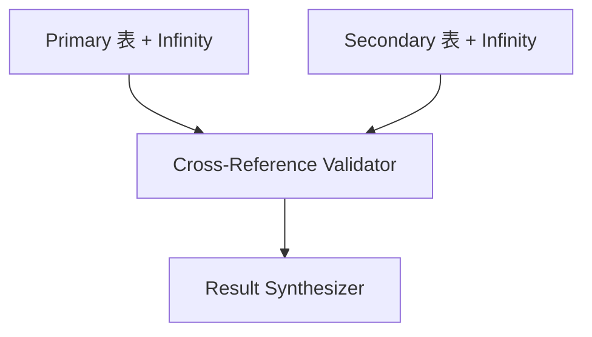

# 03_distributed_infinity_search.py — 实现原理分析

> 源文件：`cookbook/03_teams/16_search_coordination/03_distributed_infinity_search.py`

## 概述

本示例展示 **双 LanceDB 表 + Infinity 本地/自托管 Reranker**：`InfinityReranker(base_url=http://localhost:7997/rerank, model=BAAI/bge-reranker-base)` 分别挂在 `knowledge_primary` 与 `knowledge_secondary`，由 Primary/Secondary Searcher 分工检索，再经 Cross-Reference Validator 与 Result Synthesizer 汇总。

**核心配置一览：**

| 配置项 | 值 |
|--------|-----|
| `reranker` | `InfinityReranker` |
| 表名 | `agno_docs_primary` / `agno_docs_secondary` |
| `embedder` | `CohereEmbedder(embed-v4.0)` |

## 运行机制与因果链

需 **本地 Infinity 服务** 监听 `7997`；否则检索/rerank 失败。双表可灌不同文档切片以实现主辅检索。

## System Prompt 组装

默认 Team；成员 `instructions` 强调 infinity rerank 与主辅互补。

## Mermaid 流程图

```mermaid
flowchart TD
    P["Primary 表 + Infinity"] --> V["Cross-Reference Validator"]
    S["Secondary 表 + Infinity"] --> V
    V --> R["Result Synthesizer"]
```

## 关键源码文件索引

| 文件 | 作用 |
|------|------|
| `agno/knowledge/reranker/infinity.py` | `InfinityReranker` |
