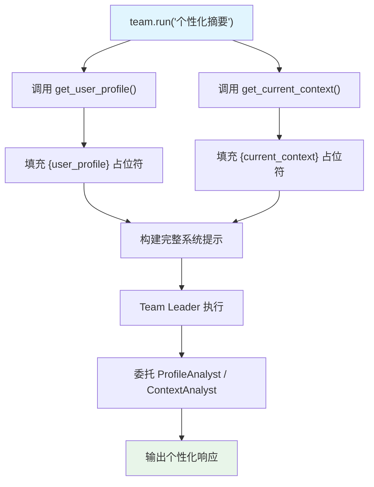

# dependencies_in_context.py — 实现原理分析

> 源文件：`cookbook/03_teams/17_dependencies/dependencies_in_context.py`

## 概述

本示例展示 **`dependencies` 注入到 Team 指令中**：通过 `dependencies` 字典传入可调用函数（`get_user_profile`、`get_current_context`），配合 `add_dependencies_to_context=True`，Agno 在运行时调用这些函数，将结果填入 `instructions` 中的 `{user_profile}` 和 `{current_context}` 占位符，动态构建个性化系统提示。

**核心配置一览：**

| 配置项 | 值 | 说明 |
|--------|------|------|
| `dependencies` | `{"user_profile": fn, "current_context": fn}` | 运行时依赖函数 |
| `add_dependencies_to_context` | `True` | 将依赖结果注入指令占位符 |
| 占位符语法 | `{user_profile}` in `instructions` | 自动替换 |

## 核心组件解析

### 占位符替换机制

```python
team = Team(
    dependencies={
        "user_profile": get_user_profile,     # 运行时调用，返回 dict
        "current_context": get_current_context,
    },
    add_dependencies_to_context=True,
    instructions=[
        "Here is the user profile: {user_profile}",      # 占位符
        "Here is the current context: {current_context}", # 占位符
    ],
)
```

运行时，`get_user_profile()` 被调用，返回值填入 `{user_profile}` 位置，动态生成完整的系统提示。

### 与 `resolve_in_context=True` 的关系

`add_dependencies_to_context=True` 是更高级的控制参数，直接将依赖结果注入到 `additional_context` 或 `instructions` 的占位符中。`resolve_in_context=True`（旧版参数）类似但专用于 `additional_context` 字段。

### 依赖值的类型

| 类型 | 示例 | 说明 |
|------|------|------|
| 可调用函数 | `get_user_profile` | 运行时调用获取值 |
| 直接值 | `{"key": "value"}` | 静态注入 |

## Mermaid 流程图



## 关键源码文件索引

| 文件 | 关键函数/类 | 作用 |
|------|------------|------|
| `agno/team/team.py` | `dependencies`, `add_dependencies_to_context` | 依赖注入配置 |
| `agno/team/_messages.py` | `_build_trailing_sections()` | 占位符替换逻辑 |
