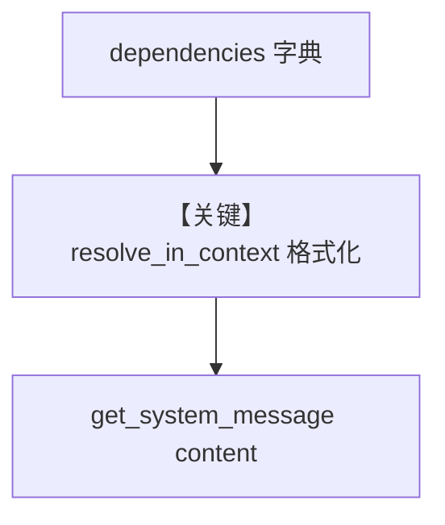

# dependencies_in_context.py — 实现原理分析

> 源文件：`cookbook/03_teams/17_dependencies/dependencies_in_context.py`

## 概述

本示例展示 **Team 级 `dependencies` 可调用对象 + `add_dependencies_to_context=True`**：在 `instructions` 中用 `{user_profile}`、`{current_context}` 占位，运行期由 `_format_message_with_state_variables` 与依赖解析合并进 **队长 system**（与 Agent 版同源逻辑，见 `agno/team/_messages.py` 尾部 resolve）。

**核心配置一览：**

| 配置项 | 值 |
|--------|-----|
| `dependencies` | `user_profile`: `get_user_profile`，`current_context`: `get_current_context` |
| `add_dependencies_to_context` | `True` |
| `instructions` | 含占位符的三条 personalization 说明 |
| `debug_mode` | `True` |

## 运行机制与因果链

`team.run(...)` 无显式传 `dependencies` 时使用构造时注册的 callable；返回 dict 注入上下文。`get_user_profile` / `get_current_context` 字面实现见 `.py` L18-42。

## System Prompt 组装

### 还原后的完整 System 文本（instructions 字面，占位符未解析前）

```text
You are a personalization team that provides personalized recommendations based on the user's profile and context.
Here is the user profile: {user_profile}
Here is the current context: {current_context}
```

解析后 `{user_profile}` 等为 JSON/字符串化 dict，取决于 `_format_message_with_state_variables` 实现。

## Mermaid 流程图


```mermaid
flowchart TD
    D["dependencies 字典"] --> F["【关键】resolve_in_context 格式化"]
    F --> S["get_system_message content"]
```

## 关键源码文件索引

| 文件 | 作用 |
|------|------|
| `agno/team/_messages.py` | `_format_message_with_state_variables` |
