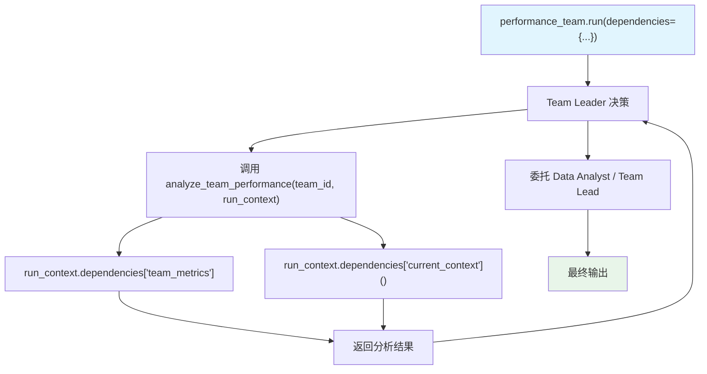

# dependencies_in_tools.py — 实现原理分析

> 源文件：`cookbook/03_teams/17_dependencies/dependencies_in_tools.py`

## 概述

本示例展示 **在 Team 工具函数中访问 `RunContext.dependencies`**：自定义工具函数 `analyze_team_performance` 的最后一个参数声明为 `run_context: RunContext`，Agno 运行时自动注入 `RunContext`，工具可通过 `run_context.dependencies` 读取运行时传入的数据（如 `team_metrics`、`current_context`）。同时展示了 `dependencies` 作为 dict 静态值（非可调用函数）传入 `run()` 的用法。

**核心配置一览：**

| 配置项 | 值 | 说明 |
|--------|------|------|
| 工具函数签名 | `fn(arg, run_context: RunContext)` | 自动注入 RunContext |
| `run_context.dependencies` | dict | 访问运行时依赖数据 |
| `dependencies` 传入时机 | `run(dependencies={...})` | 每次运行时指定 |

## 核心组件解析

### `RunContext` 自动注入

```python
def analyze_team_performance(team_id: str, run_context: RunContext) -> str:
    # Agno 检测到最后参数类型为 RunContext，自动注入
    dependencies = run_context.dependencies
    
    if "team_metrics" in dependencies:
        metrics = dependencies["team_metrics"]  # 直接访问
    if "current_context" in dependencies:
        ctx = dependencies["current_context"]   # 可调用函数已被解析
```

### 两种 `dependencies` 传入方式

```python
# 方式1：静态 dict 值
response = performance_team.run(
    input="...",
    dependencies={
        "team_metrics": {"productivity_score": 7.5, ...},  # 静态值
        "current_context": get_current_context,             # 可调用函数
    },
)

# 方式2：Team 构造时预设
team = Team(
    dependencies={"user_profile": get_user_profile},
    add_dependencies_to_context=True,
)
```

### Team 工具 vs 成员 Agent 工具

此例中 `analyze_team_performance` 是 **Team 级工具**（挂在 `performance_team.tools`），由 Team Leader 直接调用，而非委托给成员。成员（Data Analyst、Team Lead）处理 Leader 的分析结果。

## Mermaid 流程图



## 关键源码文件索引

| 文件 | 关键函数/类 | 作用 |
|------|------------|------|
| `agno/run/context.py` | `RunContext`, `RunContext.dependencies` | 运行时上下文 |
| `agno/team/team.py` | `tools`, `dependencies` | Team 工具和依赖 |
