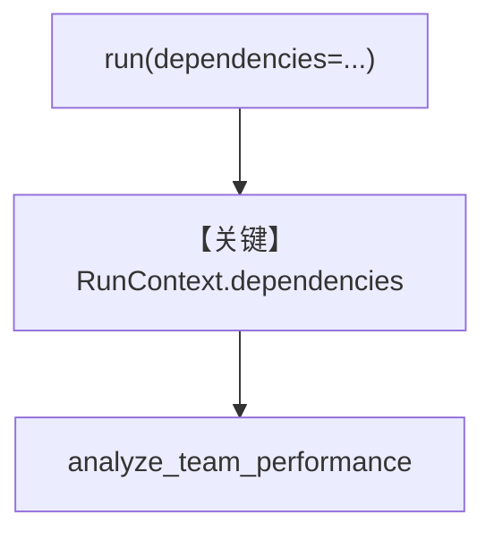

# dependencies_in_tools.py — 实现原理分析

<!-- cookbook-py-source:start -->
## 完整源码

```python
"""
Dependencies In Tools
=============================

Demonstrates passing dependencies at runtime and accessing them inside team tools.
"""

from datetime import datetime

from agno.agent import Agent
from agno.models.openai import OpenAIResponses
from agno.run import RunContext
from agno.team import Team


# ---------------------------------------------------------------------------
# Setup
# ---------------------------------------------------------------------------
def get_user_profile(user_id: str = "john_doe") -> dict:
    """Get user profile information that can be referenced in responses."""
    profiles = {
        "john_doe": {
            "name": "John Doe",
            "preferences": {
                "communication_style": "professional",
                "topics_of_interest": ["AI/ML", "Software Engineering", "Finance"],
                "experience_level": "senior",
            },
            "location": "San Francisco, CA",
            "role": "Senior Software Engineer",
        }
    }

    return profiles.get(user_id, {"name": "Unknown User"})


def get_current_context() -> dict:
    """Get current contextual information like time, weather, etc."""
    return {
        "current_time": datetime.now().strftime("%Y-%m-%d %H:%M:%S"),
        "timezone": "PST",
        "day_of_week": datetime.now().strftime("%A"),
    }


def analyze_team_performance(team_id: str, run_context: RunContext) -> str:
    """Analyze team performance using dependencies available in run context."""
    dependencies = run_context.dependencies
    if not dependencies:
        return "No data sources available for analysis."

    print(f"--> Team tool received data sources: {list(dependencies.keys())}")

    results = [f"=== TEAM PERFORMANCE ANALYSIS FOR {team_id.upper()} ==="]

    if "team_metrics" in dependencies:
        metrics_data = dependencies["team_metrics"]
        results.append(f"Team Metrics: {metrics_data}")

        if metrics_data.get("productivity_score"):
            score = metrics_data["productivity_score"]
            if score >= 8:
                results.append(
                    f"Performance Analysis: Excellent performance with {score}/10 productivity score"
                )
            elif score >= 6:
                results.append(
                    f"Performance Analysis: Good performance with {score}/10 productivity score"
                )
            else:
                results.append(
                    f"Performance Analysis: Needs improvement with {score}/10 productivity score"
                )

    if "current_context" in dependencies:
        context_data = dependencies["current_context"]
        results.append(f"Current Context: {context_data}")
        results.append(
            f"Time-based Analysis: Team analysis performed on {context_data['day_of_week']} at {context_data['current_time']}"
        )

    print(f"--> Team tool returned results: {results}")
    return "\n\n".join(results)


# ---------------------------------------------------------------------------
# Create Members
# ---------------------------------------------------------------------------
data_analyst = Agent(
    model=OpenAIResponses(id="gpt-5.2"),
    name="Data Analyst",
    description="Specialist in analyzing team metrics and performance data",
    instructions=[
        "You are a data analysis expert focusing on team performance metrics.",
        "Interpret quantitative data and identify trends.",
        "Provide data-driven insights and recommendations.",
    ],
)

team_lead = Agent(
    model=OpenAIResponses(id="gpt-5.2"),
    name="Team Lead",
    description="Experienced team leader who provides strategic insights",
    instructions=[
        "You are an experienced team leader and management expert.",
        "Focus on leadership insights and team dynamics.",
        "Provide strategic recommendations for team improvement.",
        "Collaborate with the data analyst to get comprehensive insights.",
    ],
)

# ---------------------------------------------------------------------------
# Create Team
# ---------------------------------------------------------------------------
personalization_team = Team(
    name="PersonalizationTeam",
    model=OpenAIResponses(id="gpt-5.2"),
    members=[],
    instructions=[
        "Analyze the user profile and current context to provide a personalized summary of today's priorities."
    ],
    markdown=True,
)

performance_team = Team(
    model=OpenAIResponses(id="gpt-5.2"),
    members=[data_analyst, team_lead],
    tools=[analyze_team_performance],
    name="Team Performance Analysis Team",
    description="A team specialized in analyzing team performance using integrated data sources.",
    instructions=[
        "You are a team performance analysis unit with access to team metrics and analysis tools.",
        "When asked to analyze any team, use the analyze_team_performance tool first.",
        "This tool has access to team metrics and current context through integrated data sources.",
        "Data Analyst: Focus on the quantitative metrics and trends.",
        "Team Lead: Provide strategic insights and management recommendations.",
        "Work together to provide comprehensive team performance insights.",
    ],
)

# ---------------------------------------------------------------------------
# Run Team
# ---------------------------------------------------------------------------
if __name__ == "__main__":
    print("=== Team Tool Dependencies Access Example ===\n")

    personalization_response = personalization_team.run(
        "Please provide me with a personalized summary of today's priorities based on my profile and interests.",
        dependencies={
            "user_profile": get_user_profile,
            "current_context": get_current_context,
        },
        add_dependencies_to_context=True,
    )
    print(personalization_response.content)

    response = performance_team.run(
        input="Please analyze the 'engineering_team' performance and provide comprehensive insights about their productivity and recommendations for improvement.",
        dependencies={
            "team_metrics": {
                "team_name": "Engineering Team Alpha",
                "team_size": 8,
                "productivity_score": 7.5,
                "sprint_velocity": 85,
                "bug_resolution_rate": 92,
                "code_review_turnaround": "2.3 days",
                "areas": ["Backend Development", "Frontend Development", "DevOps"],
            },
            "current_context": get_current_context,
        },
        session_id="test_team_tool_dependencies",
    )

    print(f"\nTeam Response: {response.content}")
```

<!-- cookbook-py-source:end -->

> 源文件：`cookbook/03_teams/17_dependencies/dependencies_in_tools.py`

## 概述

本示例展示 **`run_context.dependencies` 在 Team 自定义工具中的读取**：`analyze_team_performance(team_id, run_context)` 从 `run_context.dependencies` 取 `team_metrics`、`current_context`；另含 **`members=[]` 的 personalization_team** 仅队长，与 **带成员的 performance_team** 对比。

**核心配置一览：**

| Team | 要点 |
|------|------|
| `personalization_team` | `members=[]`，`run(dependencies={...}, add_dependencies_to_context=True)` |
| `performance_team` | `tools=[analyze_team_performance]`，`dependencies` 含结构化 `team_metrics` |

## 运行机制与因果链

工具函数在队长或成员调用时拿到 **同一 RunContext**，与 `add_dependencies_to_context` 注入 system 并行存在。

## System Prompt 组装

`performance_team` 的 `instructions` L131-138 定义何时调用工具；还原须复制 `.py` 原文。

## Mermaid 流程图


```mermaid
flowchart TD
    R["run(dependencies=...)"] --> RC["【关键】RunContext.dependencies"]
    RC --> T["analyze_team_performance"]
```

## 关键源码文件索引

| 文件 | 作用 |
|------|------|
| `agno/run/__init__.py` / `RunContext` | `dependencies` 字段 |
