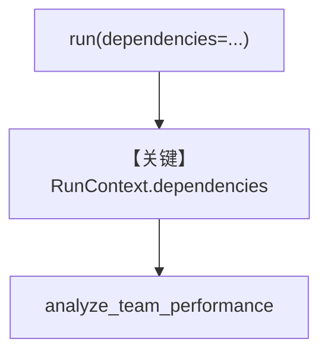

# dependencies_in_tools.py — 实现原理分析

> 源文件：`cookbook/03_teams/17_dependencies/dependencies_in_tools.py`

## 概述

本示例展示 **`run_context.dependencies` 在 Team 自定义工具中的读取**：`analyze_team_performance(team_id, run_context)` 从 `run_context.dependencies` 取 `team_metrics`、`current_context`；另含 **`members=[]` 的 personalization_team** 仅队长，与 **带成员的 performance_team** 对比。

**核心配置一览：**

| Team | 要点 |
|------|------|
| `personalization_team` | `members=[]`，`run(dependencies={...}, add_dependencies_to_context=True)` |
| `performance_team` | `tools=[analyze_team_performance]`，`dependencies` 含结构化 `team_metrics` |

## 运行机制与因果链

工具函数在队长或成员调用时拿到 **同一 RunContext**，与 `add_dependencies_to_context` 注入 system 并行存在。

## System Prompt 组装

`performance_team` 的 `instructions` L131-138 定义何时调用工具；还原须复制 `.py` 原文。

## Mermaid 流程图

```mermaid
flowchart TD
    R["run(dependencies=...)"] --> RC["【关键】RunContext.dependencies"]
    RC --> T["analyze_team_performance"]
```

## 关键源码文件索引

| 文件 | 作用 |
|------|------|
| `agno/run/__init__.py` / `RunContext` | `dependencies` 字段 |
