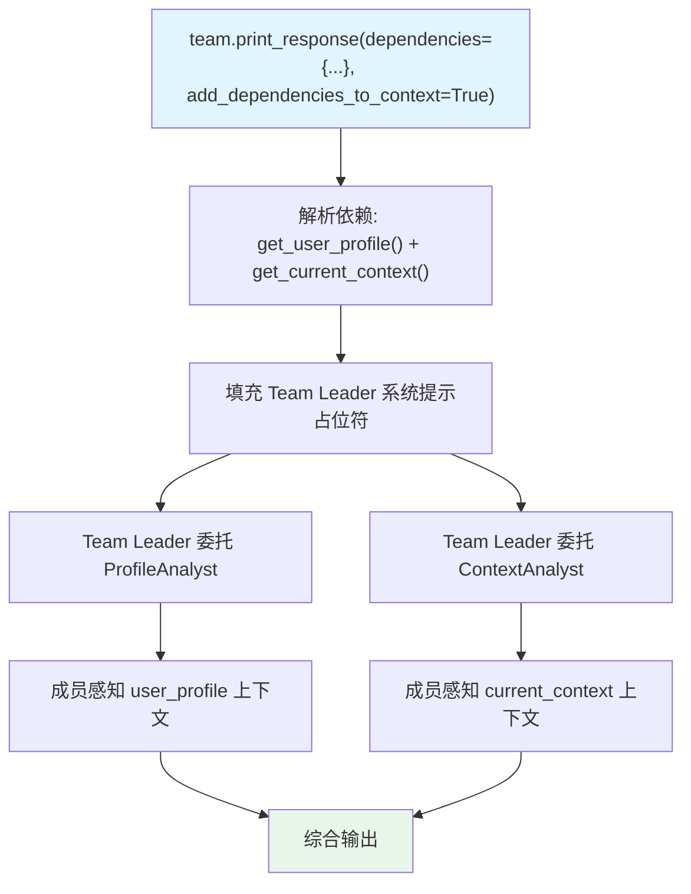

# dependencies_to_members.py — 实现原理分析

> 源文件：`cookbook/03_teams/17_dependencies/dependencies_to_members.py`

## 概述

本示例展示 **`dependencies` 通过 `add_dependencies_to_context=True` 传播到成员 Agent**：在 `team.print_response()` 时传入 `dependencies` 和 `add_dependencies_to_context=True`，Team Leader 的指令中的占位符会被填充，且成员 Agent 在被委托时也能感知到相同的依赖上下文，实现全链路的上下文一致性。

**核心配置一览：**

| 配置项 | 传入位置 | 说明 |
|--------|---------|------|
| `dependencies` | `print_response()` 参数 | 运行时传入（非构造时） |
| `add_dependencies_to_context` | `print_response()` 参数 | 动态启用 |
| `show_members_responses` | `Team` 构造 | 显示成员响应 |
| `debug_mode` | `print_response()` 参数 | 运行时开启调试 |

## 核心组件解析

### 运行时 vs 构造时传入 `dependencies`

```python
# 构造时（静态，每次 run 都生效）
team = Team(
    dependencies={"user_profile": get_user_profile},
)

# 运行时（动态，仅本次 run 生效）
team.print_response(
    "...",
    dependencies={
        "user_profile": get_user_profile,
        "current_context": get_current_context,
    },
    add_dependencies_to_context=True,
)
```

运行时传入更灵活，适合同一 Team 实例服务不同用户场景。

### `debug_mode` 运行时开启

```python
team.print_response(
    ...,
    debug_mode=True,  # 仅本次开启调试日志
)
```

无需修改 Team 构造，临时调试特定运行。

### 成员感知依赖

`add_dependencies_to_context=True` 不仅作用于 Team Leader 的系统提示，也会将依赖上下文传递给被委托的成员 Agent，确保 ProfileAnalyst 和 ContextAnalyst 能直接利用用户画像和当前上下文生成精准响应。

## Mermaid 流程图



## 关键源码文件索引

| 文件 | 关键函数/类 | 作用 |
|------|------------|------|
| `agno/team/team.py` | `print_response(dependencies=..., add_dependencies_to_context=...)` | 运行时依赖注入 |
| `agno/team/_messages.py` | `_build_trailing_sections()` | 依赖值填充逻辑 |
