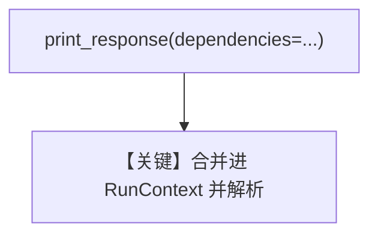

# dependencies_to_members.py — 实现原理分析

<!-- cookbook-py-source:start -->
## 完整源码

```python
"""
Dependencies To Members
=============================

Demonstrates passing dependencies on run and propagating them to member agents.
"""

from datetime import datetime

from agno.agent import Agent
from agno.models.openai import OpenAIResponses
from agno.team import Team


# ---------------------------------------------------------------------------
# Setup
# ---------------------------------------------------------------------------
def get_user_profile(user_id: str = "john_doe") -> dict:
    """Get user profile information that can be referenced in responses."""
    profiles = {
        "john_doe": {
            "name": "John Doe",
            "preferences": {
                "communication_style": "professional",
                "topics_of_interest": ["AI/ML", "Software Engineering", "Finance"],
                "experience_level": "senior",
            },
            "location": "San Francisco, CA",
            "role": "Senior Software Engineer",
        }
    }

    return profiles.get(user_id, {"name": "Unknown User"})


def get_current_context() -> dict:
    """Get current contextual information like time, weather, etc."""
    return {
        "current_time": datetime.now().strftime("%Y-%m-%d %H:%M:%S"),
        "timezone": "PST",
        "day_of_week": datetime.now().strftime("%A"),
    }


# ---------------------------------------------------------------------------
# Create Members
# ---------------------------------------------------------------------------
profile_agent = Agent(
    name="ProfileAnalyst",
    model=OpenAIResponses(id="gpt-5.2"),
    instructions="You analyze user profiles and provide personalized recommendations.",
)

context_agent = Agent(
    name="ContextAnalyst",
    model=OpenAIResponses(id="gpt-5.2"),
    instructions="You analyze current context and timing to provide relevant insights.",
)

# ---------------------------------------------------------------------------
# Create Team
# ---------------------------------------------------------------------------
team = Team(
    name="PersonalizationTeam",
    model=OpenAIResponses(id="gpt-5.2"),
    members=[profile_agent, context_agent],
    markdown=True,
    show_members_responses=True,
)

# ---------------------------------------------------------------------------
# Run Team
# ---------------------------------------------------------------------------
if __name__ == "__main__":
    team.print_response(
        "Please provide me with a personalized summary of today's priorities based on my profile and interests.",
        dependencies={
            "user_profile": get_user_profile,
            "current_context": get_current_context,
        },
        add_dependencies_to_context=True,
        debug_mode=True,
    )
```

<!-- cookbook-py-source:end -->

> 源文件：`cookbook/03_teams/17_dependencies/dependencies_to_members.py`

## 概述

本示例展示 **在 `print_response` 调用时传入 `dependencies` 与 `add_dependencies_to_context=True`**，使运行期依赖注入队长及（按框架策略）成员上下文；构造期 **不** 在 Team 上固定 `dependencies` 字典。

**核心配置一览：**

| 配置项 | 值 |
|--------|-----|
| `Team` | `PersonalizationTeam`，两成员，无构造期 `dependencies` |
| `print_response` 参数 | `dependencies={"user_profile": get_user_profile, "current_context": get_current_context}` |

## 运行机制与因果链

与「构造期 dependencies」相对，本例强调 **按次 run 注入**，适合请求级数据。

## Mermaid 流程图


```mermaid
flowchart TD
    P["print_response(dependencies=...)"] --> M["【关键】合并进 RunContext 并解析"]
```

## 关键源码文件索引

| 文件 | 作用 |
|------|------|
| `agno/team/_run.py` | run 参数转发 RunContext |
