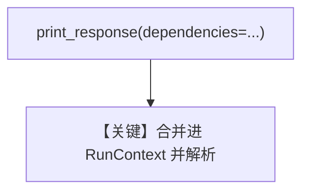

# dependencies_to_members.py — 实现原理分析

> 源文件：`cookbook/03_teams/17_dependencies/dependencies_to_members.py`

## 概述

本示例展示 **在 `print_response` 调用时传入 `dependencies` 与 `add_dependencies_to_context=True`**，使运行期依赖注入队长及（按框架策略）成员上下文；构造期 **不** 在 Team 上固定 `dependencies` 字典。

**核心配置一览：**

| 配置项 | 值 |
|--------|-----|
| `Team` | `PersonalizationTeam`，两成员，无构造期 `dependencies` |
| `print_response` 参数 | `dependencies={"user_profile": get_user_profile, "current_context": get_current_context}` |

## 运行机制与因果链

与「构造期 dependencies」相对，本例强调 **按次 run 注入**，适合请求级数据。

## Mermaid 流程图

```mermaid
flowchart TD
    P["print_response(dependencies=...)"] --> M["【关键】合并进 RunContext 并解析"]
```

## 关键源码文件索引

| 文件 | 作用 |
|------|------|
| `agno/team/_run.py` | run 参数转发 RunContext |
