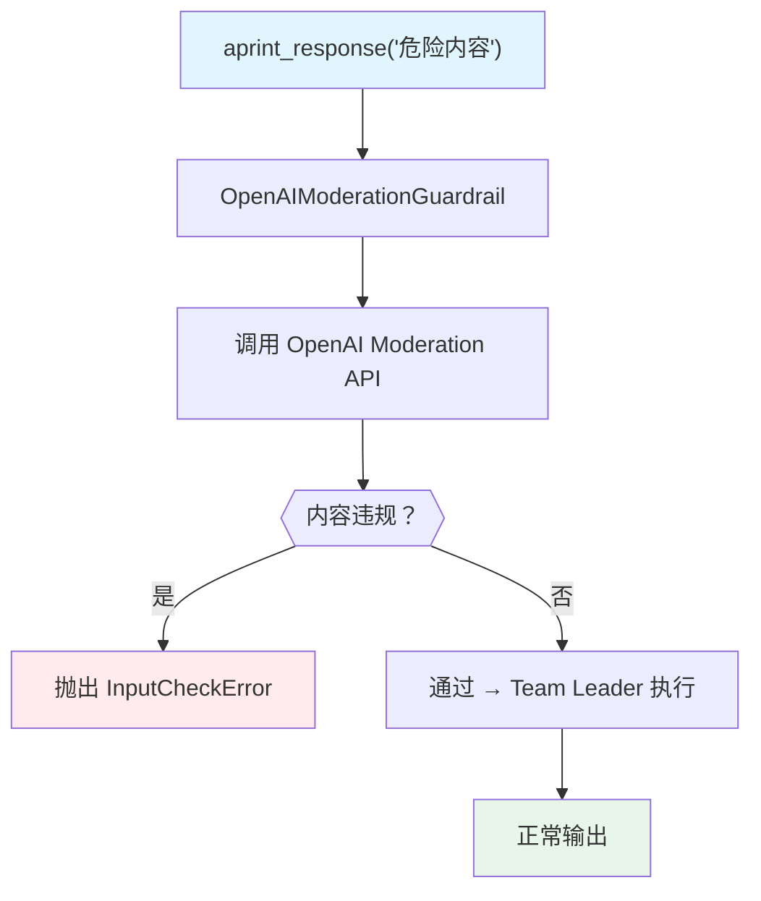

# openai_moderation.py — 实现原理分析

> 源文件：`cookbook/03_teams/18_guardrails/openai_moderation.py`

## 概述

本示例展示 **`OpenAIModerationGuardrail` 内容审核护栏**：将 `OpenAIModerationGuardrail` 配置为 `pre_hooks`，在用户输入到达 Team 之前调用 OpenAI Moderation API 检测违规内容（暴力、仇恨言论、自我伤害等）。违规时抛出 `InputCheckError`，正常内容则直接通过。支持自定义拦截分类和多模态输入（图片）。

**核心配置一览：**

| 配置项 | 值 | 说明 |
|--------|------|------|
| `pre_hooks` | `[OpenAIModerationGuardrail()]` | 默认拦截所有违规类别 |
| `raise_for_categories` | `["violence", "hate", ...]` | 自定义拦截类别 |
| 异常类型 | `InputCheckError` | 拦截时抛出 |
| 支持模态 | 文本 + 图片 | Moderation API 多模态 |

## 核心组件解析

### 两种配置模式

```python
# 默认模式：拦截所有违规类别
basic_team = Team(
    pre_hooks=[OpenAIModerationGuardrail()],
    ...
)

# 自定义模式：只拦截特定类别
custom_team = Team(
    pre_hooks=[
        OpenAIModerationGuardrail(
            raise_for_categories=["violence", "violence/graphic", "hate", "hate/threatening"]
        )
    ],
    ...
)
```

### 错误处理

```python
try:
    await team.aprint_response(input="危险内容")
except InputCheckError as e:
    print(e.message)          # 拦截原因描述
    print(e.check_trigger)    # 触发的规则/类别
    print(e.additional_data)  # 额外数据（如 JSON 详情）
```

### 图片内容审核

```python
unsafe_image = Image(url="https://...violent_image.jpg")
await custom_team.aprint_response(
    input="What do you see in this image?",
    images=[unsafe_image]  # 同时审核图片内容
)
```

## Mermaid 流程图



## 关键源码文件索引

| 文件 | 关键函数/类 | 作用 |
|------|------------|------|
| `agno/guardrails/__init__.py` | `OpenAIModerationGuardrail` | OpenAI 内容审核护栏 |
| `agno/exceptions.py` | `InputCheckError` | 输入检查异常 |
