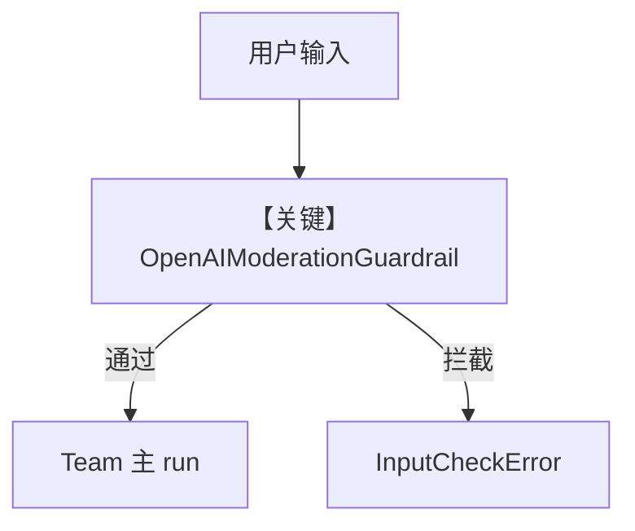

# openai_moderation.py — 实现原理分析

> 源文件：`cookbook/03_teams/18_guardrails/openai_moderation.py`

## 概述

本示例展示 **`OpenAIModerationGuardrail` 作为 `pre_hooks`**：在 Team run 前调用 OpenAI Moderation API；`basic_team` 用默认策略，`custom_team` 用 `raise_for_categories` 限定仅对暴力/仇恨等类别拦截。

**核心配置一览：**

| 配置项 | 值 |
|--------|-----|
| `pre_hooks` | `[OpenAIModerationGuardrail()]` 或带 `raise_for_categories=[...]` |
| `members` | `[]`（仅队长） |
| `model` | `OpenAIResponses(gpt-5.2)` |

## 运行机制与因果链

命中策略则抛 `InputCheckError`，run 不进入模型主循环。

## System Prompt 组装

`description` / `instructions` 见 `.py`；moderation **不改变** system 正文，属前置网关。

## Mermaid 流程图

```mermaid
flowchart TD
    I["用户输入"] --> G["【关键】OpenAIModerationGuardrail"]
    G -->|通过| M["Team 主 run"]
    G -->|拦截| X["InputCheckError"]
```

## 关键源码文件索引

| 文件 | 作用 |
|------|------|
| `agno/guardrails/` | `OpenAIModerationGuardrail` |
