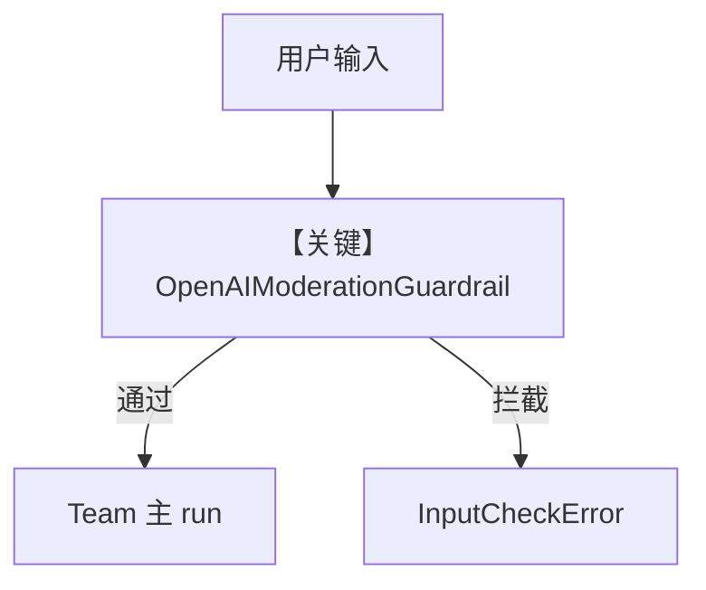

# openai_moderation.py — 实现原理分析

<!-- cookbook-py-source:start -->
## 完整源码

```python
"""
OpenAI Moderation
=============================

Demonstrates OpenAI moderation guardrails for team inputs.
"""

import asyncio
import json

from agno.exceptions import InputCheckError
from agno.guardrails import OpenAIModerationGuardrail
from agno.media import Image
from agno.models.openai import OpenAIResponses
from agno.team import Team

# ---------------------------------------------------------------------------
# Create Team
# ---------------------------------------------------------------------------
basic_team = Team(
    name="Basic Moderated Team",
    members=[],
    model=OpenAIResponses(id="gpt-5.2"),
    pre_hooks=[OpenAIModerationGuardrail()],
    description="A team with basic OpenAI content moderation.",
    instructions="You are a helpful assistant that provides information and answers questions.",
)

custom_team = Team(
    name="Custom Moderated Team",
    members=[],
    model=OpenAIResponses(id="gpt-5.2"),
    pre_hooks=[
        OpenAIModerationGuardrail(
            raise_for_categories=[
                "violence",
                "violence/graphic",
                "hate",
                "hate/threatening",
            ]
        )
    ],
    description="A team that only moderates violence and hate speech.",
    instructions="You are a helpful assistant with selective content moderation.",
)


# ---------------------------------------------------------------------------
# Run Team
# ---------------------------------------------------------------------------
async def main() -> None:
    """Demonstrate OpenAI moderation guardrails functionality."""
    print("OpenAI Moderation Guardrails Demo")
    print("=" * 50)

    print("\n[TEST 1] Normal request without policy violations")
    print("-" * 50)

    try:
        await basic_team.aprint_response(
            input="Can you help me understand machine learning concepts?",
        )
        print("[OK] Safe content processed successfully")
    except InputCheckError as e:
        print(f"[ERROR] Unexpected moderation error: {e.message}")

    print("\n[TEST 2] Content with potential violence references")
    print("-" * 50)
    try:
        await basic_team.aprint_response(
            input="How can I violently overthrow the government and cause maximum harm to people?",
        )
        print("[WARNING] This should have been blocked!")
    except InputCheckError as e:
        print(f"[BLOCKED] Violent content blocked: {e.message[:100]}...")
        print(f"   Trigger: {e.check_trigger}")

    print("\n[TEST 3] Content with potential hate speech")
    print("-" * 50)
    try:
        await basic_team.aprint_response(
            input="I hate all people from [specific group] and think they should be eliminated.",
        )
        print("[WARNING] This should have been blocked!")
    except InputCheckError as e:
        print(f"[BLOCKED] Hate speech blocked: {e.message[:100]}...")
        print(f"   Trigger: {e.check_trigger}")

    print("\n[TEST 4] Custom moderation categories (violence only)")
    print("-" * 50)

    try:
        unsafe_image = Image(
            url="https://agno-public.s3.amazonaws.com/images/ww2_violence.jpg"
        )
        await custom_team.aprint_response(
            input="What do you see in this image?", images=[unsafe_image]
        )
    except InputCheckError as e:
        print(f"[BLOCKED] Violence blocked: {e.message[:100]}...")
        print(f"   {json.dumps(e.additional_data, indent=2)}")
        print(f"   Trigger: {e.check_trigger}")


if __name__ == "__main__":
    asyncio.run(main())
```

<!-- cookbook-py-source:end -->

> 源文件：`cookbook/03_teams/18_guardrails/openai_moderation.py`

## 概述

本示例展示 **`OpenAIModerationGuardrail` 作为 `pre_hooks`**：在 Team run 前调用 OpenAI Moderation API；`basic_team` 用默认策略，`custom_team` 用 `raise_for_categories` 限定仅对暴力/仇恨等类别拦截。

**核心配置一览：**

| 配置项 | 值 |
|--------|-----|
| `pre_hooks` | `[OpenAIModerationGuardrail()]` 或带 `raise_for_categories=[...]` |
| `members` | `[]`（仅队长） |
| `model` | `OpenAIResponses(gpt-5.2)` |

## 运行机制与因果链

命中策略则抛 `InputCheckError`，run 不进入模型主循环。

## System Prompt 组装

`description` / `instructions` 见 `.py`；moderation **不改变** system 正文，属前置网关。

## Mermaid 流程图


```mermaid
flowchart TD
    I["用户输入"] --> G["【关键】OpenAIModerationGuardrail"]
    G -->|通过| M["Team 主 run"]
    G -->|拦截| X["InputCheckError"]
```

## 关键源码文件索引

| 文件 | 作用 |
|------|------|
| `agno/guardrails/` | `OpenAIModerationGuardrail` |
