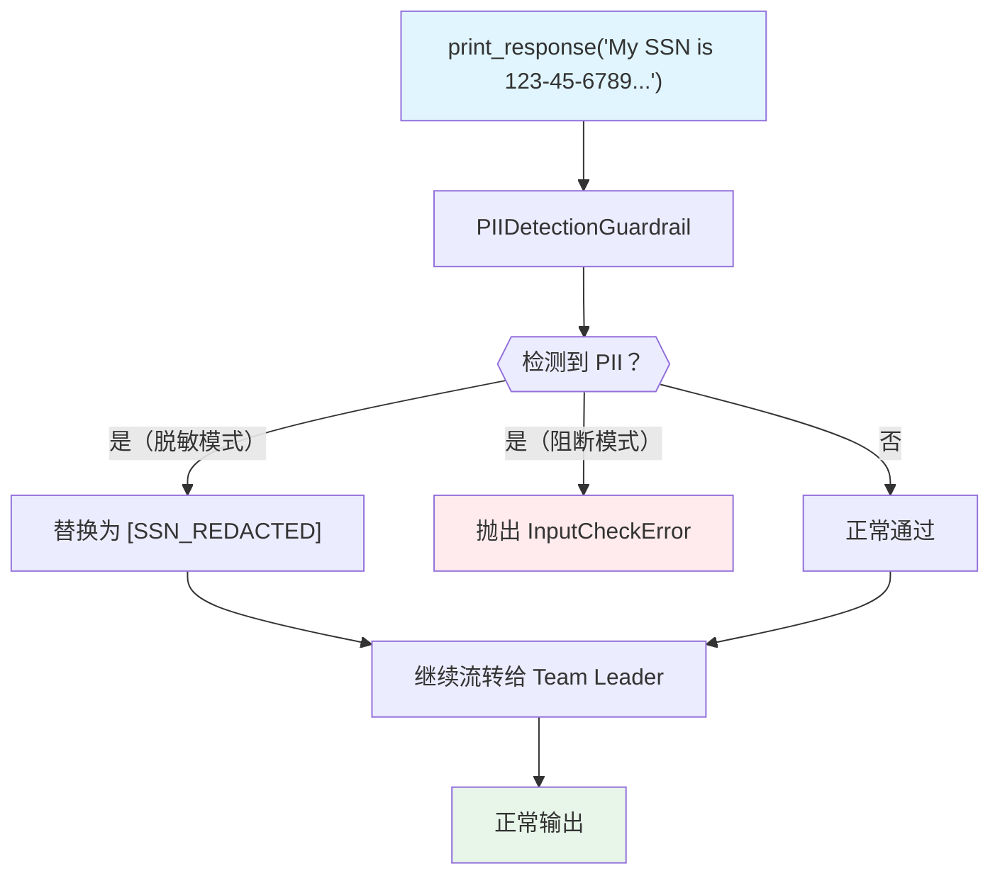

# pii_detection.py — 实现原理分析

> 源文件：`cookbook/03_teams/18_guardrails/pii_detection.py`

## 概述

本示例展示 **`PIIDetectionGuardrail` 个人隐私信息检测护栏**：在用户输入到达 Team 之前检测 SSN、信用卡号、邮箱、电话等 PII 数据。支持两种模式：**阻断模式**（抛出 `InputCheckError`）和 **脱敏模式**（`mask_pii=True`，将 PII 替换为掩码后继续处理）。

**核心配置一览：**

| 配置项 | 模式 | 行为 |
|--------|------|------|
| `PIIDetectionGuardrail()` | 阻断 | 检测到 PII 抛出 `InputCheckError` |
| `PIIDetectionGuardrail(mask_pii=True)` | 脱敏 | 将 PII 替换为掩码，输入继续流转 |

## 核心组件解析

### 两种处理模式

```python
# 阻断模式：拒绝包含 PII 的输入
blocking_team = Team(
    pre_hooks=[PIIDetectionGuardrail()],
    ...
)

# 脱敏模式：脱敏后继续处理
masked_team = Team(
    pre_hooks=[PIIDetectionGuardrail(mask_pii=True)],
    ...
)
```

### 检测的 PII 类型

| PII 类型 | 示例 |
|---------|------|
| SSN（社会安全号） | `123-45-6789` |
| 信用卡号 | `4532 1234 5678 9012` |
| 邮箱地址 | `john.doe@example.com` |
| 电话号码 | `555-123-4567` / `555.987.6543` |

### 脱敏模式行为

```python
# 输入：
"My SSN is 123-45-6789. Can you help me?"

# 脱敏后传入 Team：
"My SSN is [SSN_REDACTED]. Can you help me?"
```

Team 仍能理解上下文并正常响应，但 PII 不会暴露给 LLM。

## Mermaid 流程图



## 关键源码文件索引

| 文件 | 关键函数/类 | 作用 |
|------|------------|------|
| `agno/guardrails/__init__.py` | `PIIDetectionGuardrail` | PII 检测护栏 |
| `agno/exceptions.py` | `InputCheckError` | 输入检查异常 |
