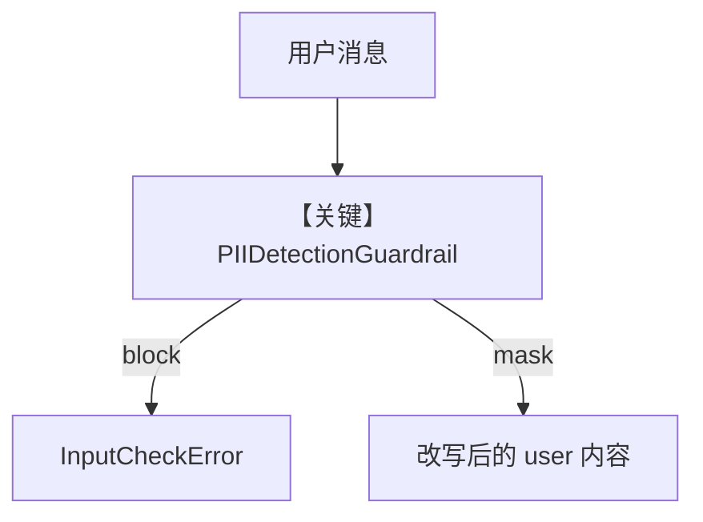

# pii_detection.py — 实现原理分析

<!-- cookbook-py-source:start -->
## 完整源码

```python
"""
PII Detection
=============================

Demonstrates PII detection guardrails for team input protection.
"""

from agno.exceptions import InputCheckError
from agno.guardrails import PIIDetectionGuardrail
from agno.models.openai import OpenAIResponses
from agno.team import Team

# ---------------------------------------------------------------------------
# Create Team
# ---------------------------------------------------------------------------
blocking_team = Team(
    name="Privacy-Protected Team",
    members=[],
    model=OpenAIResponses(id="gpt-5.2"),
    pre_hooks=[PIIDetectionGuardrail()],
    description="A team that helps with customer service while protecting privacy.",
    instructions="You are a helpful customer service assistant. Always protect user privacy and handle sensitive information appropriately.",
)

masked_team = Team(
    name="Privacy-Protected Team",
    members=[],
    model=OpenAIResponses(id="gpt-5.2"),
    pre_hooks=[PIIDetectionGuardrail(mask_pii=True)],
    description="A team that helps with customer service while protecting privacy.",
    instructions="You are a helpful customer service assistant. Always protect user privacy and handle sensitive information appropriately.",
)


# ---------------------------------------------------------------------------
# Run Team
# ---------------------------------------------------------------------------
def main() -> None:
    """Demonstrate PII detection guardrails functionality."""
    print("PII Detection Guardrails Demo")
    print("=" * 50)

    print("\n[TEST 1] Normal request without PII")
    print("-" * 30)
    try:
        blocking_team.print_response(
            input="Can you help me understand your return policy?",
        )
        print("[OK] Normal request processed successfully")
    except InputCheckError as e:
        print(f"[ERROR] Unexpected error: {e}")

    print("\n[TEST 2] Input containing SSN")
    print("-" * 30)
    try:
        blocking_team.print_response(
            input="Hi, my Social Security Number is 123-45-6789. Can you help me with my account?",
        )
        print("[WARNING] This should have been blocked!")
    except InputCheckError as e:
        print(f"[BLOCKED] PII blocked: {e.message}")
        print(f"   Trigger: {e.check_trigger}")

    print("\n[TEST 3] Input containing credit card")
    print("-" * 30)
    try:
        blocking_team.print_response(
            input="I'd like to update my payment method. My new card number is 4532 1234 5678 9012.",
        )
        print("[WARNING] This should have been blocked!")
    except InputCheckError as e:
        print(f"[BLOCKED] PII blocked: {e.message}")
        print(f"   Trigger: {e.check_trigger}")

    print("\n[TEST 4] Input containing email address")
    print("-" * 30)
    try:
        blocking_team.print_response(
            input="Please send the receipt to john.doe@example.com for my recent purchase.",
        )
        print("[WARNING] This should have been blocked!")
    except InputCheckError as e:
        print(f"[BLOCKED] PII blocked: {e.message}")
        print(f"   Trigger: {e.check_trigger}")

    print("\n[TEST 5] Input containing phone number")
    print("-" * 30)
    try:
        blocking_team.print_response(
            input="My phone number is 555-123-4567. Please call me about my order status.",
        )
        print("[WARNING] This should have been blocked!")
    except InputCheckError as e:
        print(f"[BLOCKED] PII blocked: {e.message}")
        print(f"   Trigger: {e.check_trigger}")

    print("\n[TEST 6] Multiple PII types in one request")
    print("-" * 30)
    try:
        blocking_team.print_response(
            input="Hi, I'm John Smith. My email is john@company.com and phone is 555.987.6543. I need help with my account.",
        )
        print("[WARNING] This should have been blocked!")
    except InputCheckError as e:
        print(f"[BLOCKED] PII blocked: {e.message}")
        print(f"   Trigger: {e.check_trigger}")

    print("\n[TEST 7] PII with different formatting")
    print("-" * 30)
    try:
        blocking_team.print_response(
            input="Can you verify my credit card ending in 4532123456789012?",
        )
        print("[WARNING] This should have been blocked!")
    except InputCheckError as e:
        print(f"[BLOCKED] PII blocked: {e.message}")
        print(f"   Trigger: {e.check_trigger}")

    print("\n[TEST 8] Input containing SSN (masked mode)")
    print("-" * 30)
    masked_team.print_response(
        input="Hi, my Social Security Number is 123-45-6789. Can you help me with my account?",
    )


if __name__ == "__main__":
    main()
```

<!-- cookbook-py-source:end -->

> 源文件：`cookbook/03_teams/18_guardrails/pii_detection.py`

## 概述

本示例展示 **`PIIDetectionGuardrail`**：`blocking_team` 检测到 PII 则拒绝；`masked_team` 传 `mask_pii=True` 时对输入脱敏后继续。

**核心配置一览：**

| 配置项 | blocking_team | masked_team |
|--------|---------------|-------------|
| `pre_hooks` | `[PIIDetectionGuardrail()]` | `[PIIDetectionGuardrail(mask_pii=True)]` |

## 运行机制与因果链

与 OpenAI moderation 相同：**pre_hook 先于** `get_run_messages`；脱敏路径会改写进入模型的用户文本。

## System Prompt 组装

`instructions` 字面：

```text
You are a helpful customer service assistant. Always protect user privacy and handle sensitive information appropriately.
```

## Mermaid 流程图


```mermaid
flowchart TD
    U["用户消息"] --> P["【关键】PIIDetectionGuardrail"]
    P -->|block| E["InputCheckError"]
    P -->|mask| N["改写后的 user 内容"]
```

## 关键源码文件索引

| 文件 | 作用 |
|------|------|
| `agno/guardrails/` | `PIIDetectionGuardrail` |
